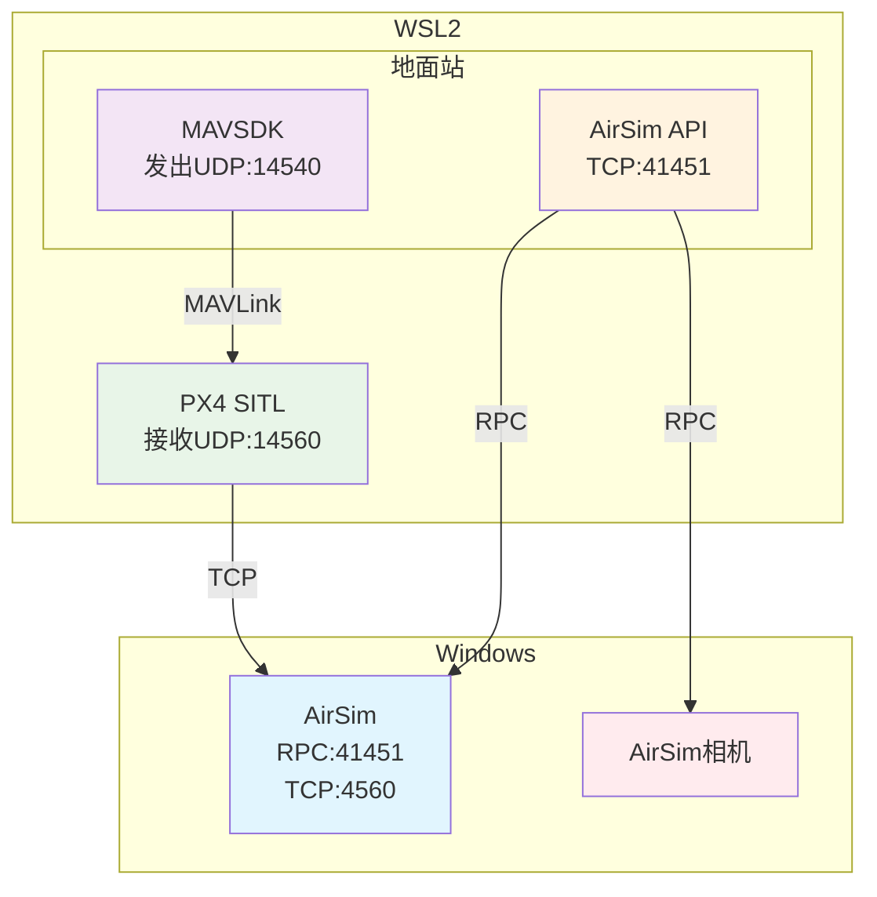

## 1. 网络拓扑



### 1.1 端口配置详解

#### 核心端口分配与说明

**WSL2: MAVSDK**
- **地址**: `udpin://127.0.0.1:14540` (MAVLink)
- **说明**: MAVSDK 默认监听 PX4 SITL 的 MAVLink 数据流（14540 为 MAVLink 默认端口），因为PX4 SITL无法广播UDP，MAVSDK应放到PX4同一环境运行（参见2）
- **方向**: PX4 SITL → 地面站

**WSL2: AirSim API**
- **地址**: `0.0.0.0:41451` (RPC)
- **说明**: AirSim 提供的默认RPC 接口，用于外部程序（Python/C++ 脚本等）调用控制 API
- **方向**: 地面站 ↔ AirSim

**Windows: AirSim (PX4 桥接)**
- **地址**: `0.0.0.0:4560` (TCP)
- **说明**: PX4 SITL 运行在 WSL2 中，通过 PX4 桥接接口与 Windows 侧 AirSim 交互，`0.0.0.0` 监听的IP实际为宿主机在 WSL2 网络中的可访问地址（通常是 192.168.x.x 或 `/etc/resolv.conf` 里的网关地址，在`settings.json`中也要同步修改地址
- **方向**: PX4 SITL ↔ AirSim

### 1.2 AirSim Settings.json 配置示例

```json
{
    "SettingsVersion": 1.2,
    "SimMode": "Multirotor",
    "RpcEnabled": true,
    "RpcServerPort": 41451,
    "ControlIp": "0.0.0.0",
    "Vehicles": {
        "Drone1": {
            "VehicleType": "PX4Multirotor",
            "X": 0, "Y": 0, "Z": -5,
            "UseSerial": false,
            "UseTcp": true,
            "TcpPort": 4560,
            "LocalHostIp": "0.0.0.0",
            "ExternalIp": "0.0.0.0",
            "Cameras": {
                "front_center": {
                    "X": 0.5, "Y": 0, "Z": 0,
                    "Pitch": 0, "Roll": 0, "Yaw": 0,
                    "CaptureSettings": [
                        {
                            "Width": 1920,
                            "Height": 1080,
                            "ImageType": 0,
                            "FOV_Degrees": 90
                        }
                    ]
                }
            },
            "Parameters": {
                "NAV_RCL_ACT": 0,
                "NAV_DLL_ACT": 0,
                "COM_OBL_ACT": 1,
                "LPE_LAT": 47.641468,
                "LPE_LON": -122.140165
            }
        }
    }
}
```

---

## 2. 坑之一：PX4 SITL 广播和配置更改限制

#### 问题描述
- **现象**: PX4 SITL不支持动态配置更改和广播通信
- **原因**: SITL模式下的PX4固件功能受限，无法像真实硬件一样支持所有MAVLink命令，param 等命令并不会真的保存

#### 解决方案
- 在同一环境下使用PX4 SITL和MAVSDK
```python
class PX4SITLManager:
    def __init__(self):
        self.drone = System()
        # 使用本地连接
        self.connection_string = "udpin://127.0.0.1:14540"
    
    def connect(self):
        await self.drone.connect(system_address=self.connection_string)

        async for state in self.drone.core.connection_state():
            if state.is_connected:
                break
```


---

## 3. 坑之二：AirSim 相机集成问题

### 3.1 RPC通信与MAVLink不一致

#### 问题描述
- **现象**: PX4 SITL 无法直接调用 AirSim 相机
- **原因**: PX4使用MAVLink（WSL2），AirSim相机走RPC（Windows），协议与位置均不同步

#### 解决方案：双API架构
```python
import airsim
from mavsdk import System

class DualAPIManager:
    def __init__(self):
        # MAVSDK用于飞行控制
        self.drone = System()
        # AirSim API用于相机控制
        self.airsim_client = airsim.MultirotorClient()
    
    async def setup_connections(self):
        # 连接MAVSDK
        await self.drone.connect(system_address="udpin://127.0.0.1:14540")
        
        # 连接AirSim (Windows RPC 41451)
        self.airsim_client.confirmConnection()
    
    # 此处相机名称一定要填settings中设置的相机名称，否则会导致仿真崩溃，如果不填名称默认使用低分辨率相机“0”
    def take_photo(self, camera_name: str = "front_center"):
        # 使用AirSim API拍照 (Windows RPC 41451)
        responses = self.airsim_client.simGetImages([
            airsim.ImageRequest(camera_name, airsim.ImageType.Scene)
        ])
        return responses[0]
    
    async def fly_and_capture(self, waypoints):
        # 使用MAVSDK控制飞行
        for wp in waypoints:
            await self.drone.action.goto_location(wp.lat, wp.lng, wp.alt)
            # 使用AirSim API拍照
            photo = self.take_photo()
            # 处理照片...
```

### 3.2 相机 API Bug 与解决方案

#### 问题描述
- **现象**: AirSim `simGetCameraInfo()` API导致仿真进程崩溃
- **原因**: 
  - AirSim相机信息获取API存在内存泄漏问题
  - 当调用无效相机名称或其他未知问题时，会导致仿真进程崩溃

**问题API详情**:
```python
def simGetCameraInfo(self, camera_name, vehicle_name = '', external=False):
    """
    Get details about the camera
    Args:
        camera_name (str): Name of the camera
        vehicle_name (str, optional): Vehicle which the camera is associated with
        external (bool, optional): Whether the camera is an External Camera
    Returns:
        CameraInfo: Camera information object
    """
    return CameraInfo.from_msgpack(self.client.call('simGetCameraInfo', str(camera_name), vehicle_name, external))
```

**崩溃原因**:
- 当 `camera_name` 参数无效或不存在时，RPC调用失败
- `CameraInfo.from_msgpack()` 解析失败导致内存访问错误
- 其他未知原因

**解决方案**
- 直接使用settings.json中的相机名进行拍照，可以对相机参数进行有效调整

```python
def take_photo(self, camera_name: str = "front_center", image_type: str = "Scene"):
    if camera_name not in self.cameras:
        raise ValueError(f"Unknown camera: {camera_name}")
        
    request = airsim.ImageRequest(camera_name, airsim.ImageType.Scene)
    responses = self.client.simGetImages([request])
    return responses[0]

def take_multiple_photos(self, camera_names: list = None):
    if camera_names is None:
        camera_names = ["front_center", "downward"]
    
    requests = []
    for camera in camera_names:
        if camera in self.cameras:
            requests.append(airsim.ImageRequest(camera, airsim.ImageType.Scene))
    
    return self.client.simGetImages(requests)
```

### 3.3 AirSim Settings 相机配置
- 参考 [AirSim Settings.json 配置示例](#airsim-settingsjson-配置示例)

---

## 4. 坑之三：Windows Defender 防火墙端口配置
- 如果不放开对应端口，会导致PX4 SITL和Airsim通信失败

### 4.1 防火墙端口配置步骤

#### 步骤1：打开 Windows Defender 防火墙高级设置
```bash
# 方法1：通过控制面板
控制面板 → 系统和安全 → Windows Defender防火墙 → 高级设置

# 方法2：通过运行命令
wf.msc
```

#### 步骤2：添加入站规则
1. **选择"入站规则"** → **"新建规则"**
2. **规则类型**：选择"端口"
3. **协议和端口**：
   - 选择"TCP"
   - 选择"特定本地端口"
   - 输入端口：`14540,14550,14560,41451,4560`
4. **操作**：选择"允许连接"
5. **配置文件**：勾选"域"、"专用"、"公用"
6. **名称**：输入"AirSim PX4 SITL 端口"

#### 步骤3：添加出站规则
1. **选择"出站规则"** → **"新建规则"**
2. 重复上述步骤，但选择"出站规则"

### 4.2 验证端口连接
```bash
# 在WSL2中测试端口连通性
telnet <Windows_IP> 14540
telnet <Windows_IP> 41451
telnet <Windows_IP> 4560

# 使用netstat检查端口监听状态
netstat -an | findstr :14540
netstat -an | findstr :41451
netstat -an | findstr :4560
```

### 4.3 常见问题解决
- **端口被占用**：使用 `netstat -ano | findstr :端口号` 查看占用进程
- **防火墙阻止**：检查Windows Defender防火墙规则是否正确配置
- **WSL2网络问题**：重启WSL2服务 `wsl --shutdown`

---

## 5. 环境配置与调试指南

### 5.1 PX4 SITL 环境变量配置
```bash
# 配置PX4与AirSim的连接地址
export PX4_SIM_HOSTNAME=<Windows_IP>
export PX4_SIM_HOST_ADDR=<Windows_IP>

# 启动PX4 SITL
make px4_sitl_default none_iris

# 临时打开端口与QGC连接
mavlink start -p -o 14550
```

### 5.2 WSL2 双虚拟环境配置
- 为了在Windows下和WSL2下快速开发，可以使用双虚拟环境配置的方式
```bash
# Windows下WSL2的双虚拟环境激活命令
cd /mnt/c/Users/Username/Documents/ProjectLocation
source venv_wsl/bin/activate

# 环境说明：
# - Windows中使用.venv
# - WSL2中使用新的虚拟环境venv_wsl
```

### 5.3 快速修复与调试命令

#### 端口配置问题
```bash
# 检查端口占用
netstat -ano | findstr :14540  # Windows
lsof -i :14540                 # Linux/macOS

# 快速修复：重启PX4 SITL
pkill -f px4_sitl
make px4_sitl gazebo
```


---

## 参考文档

- [AirSim Settings](https://microsoft.github.io/AirSim/settings/)
- [Camera Views](https://microsoft.github.io/AirSim/camera_views/)
- [Upgrade Settings](https://microsoft.github.io/AirSim/upgrade_settings/)
- [PX4 SITL](https://microsoft.github.io/AirSim/px4_sitl/)
- [PX4与AirSim整合实践](https://zhuanlan.zhihu.com/p/431075863)
- [建立QGC地面站与WSL2中虚拟环境的连接](https://www.cnblogs.com/Biiigwang/p/17753556.html)

