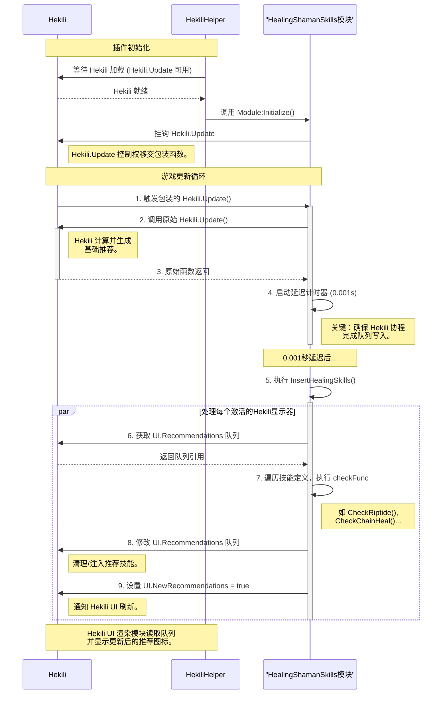

## 1. 概述

[`HekiliHelper`](https://github.com/pinyinjj/HekiliHelper) 是为《魔兽世界》插件 [`Hekili`](https://www.curseforge.com/wow/addons/hekili) 设计的辅助扩展模块。其核心目标并非独立运行，而是作为 `Hekili` 的功能延伸，提供主插件不具备的特定功能。例如，为治疗职业（如治疗萨满）提供智能技能推荐，以及为近战职业提供目标切换提示等。

本文将通过代码实例，详细阐述 `HekiliHelper` 如何实现插件间非侵入式扩展的架构范式。

## 2. 核心架构与实现原理

`HekiliHelper` 的架构清晰地展示了在《魔兽世界》插件生态中，一个插件如何对另一个插件进行扩展。其核心实现依赖于以下关键机制：

### 2.1. 插件的加载与初始化

`HekiliHelper` 的加载与初始化过程遵循严谨的流程，以确保作为宿主插件的扩展模块能够稳定运行。

1.  **依赖声明与加载顺序**：首先，通过在核心文件 `HekiliHelper.toc` 中声明对主插件的依赖 (`## Dependencies: Hekili`)，确保《魔兽世界》客户端在加载 `HekiliHelper` 之前，必定已加载 `Hekili`。
2.  **延迟初始化**：`HekiliHelper` 在自身代码加载后，并不立即执行核心逻辑。在 `HekiliHelper.lua` 的 `OnEnable` 方法中，它通过一个定时器（`C_Timer.After`）进行周期性轮询，检测 `Hekili` 是否已完全初始化。仅当确认主插件的核心更新函数 `Hekili.Update` 已存在时，`HekiliHelper` 才会启动其模块初始化，从而避免因宿主插件未就绪而导致的运行时错误。

    ```lua
    -- HekiliHelper.lua
    function HekiliHelper:OnEnable()
        -- ...
        local function CheckAndInit()
            if CheckHekiliLoaded() then
                self:InitializeModules()
            else
                -- 继续等待
                C_Timer.After(0.5, CheckAndInit)
            end
        end
        C_Timer.After(0.5, CheckAndInit)
    end

    local function CheckHekiliLoaded()
        -- 检查 Hekili 全局对象及其核心 Update 函数是否存在
        return Hekili and Hekili.Update
    end
    ```

### 2.2. 核心技术：函数钩子 (Monkey Patching)

`HekiliHelper` 与 `Hekili` 交互的核心技术是**函数钩子** (Function Hooking)，在动态语言环境中，这通常被称为**猴子补丁** (Monkey Patching)。

其核心理念是在不修改目标程序源代码的前提下，利用语言的动态特性，在程序运行时（Runtime）拦截并修改其函数行为。

*   **在 Lua 等动态脚本语言中的实现**：
    `HekiliHelper` 的实现得益于 Lua 语言自身的动态特性，即函数可以作为值进行传递和赋值，从而允许在运行时被动态替换。

    **Python 中的“猴子补丁” (Monkey Patching)**
    在 Python 中，“猴子补丁”指在运行时动态修改或替换现有模块、类或函数的代码。
    **常见应用场景**：
    *   **修复第三方库的 Bug**：在无法直接修改或等待官方补丁时，临时性地修正外部库中的缺陷。
    *   **模拟测试 (Mock Testing)**：在单元测试中替换依赖项，以精确控制测试环境。
    *   **扩展现有功能**：为现有类或函数增添新功能。

    **代码示例**:
    
    1. **功能扩展: 为 `datetime` 类添加 `is_weekend` 方法**
        ```python
        import datetime

        def monkey_patch_datetime():
            """为 datetime 类添加 is_weekend 方法"""
            def is_weekend(self):
                return self.weekday() >= 5 # 5和6代表周六和周日
            datetime.datetime.is_weekend = is_weekend

        # 应用猴子补丁
        monkey_patch_datetime()

        # 现在可调用 datetime.datetime.is_weekend 方法
        now = datetime.datetime.now()
        print(now.is_weekend()) # 输出 True 或 False
        ```

    **潜在风险与弊端**：
    *   **降低代码可读性**：由于修改并非源于代码本身，代码行为的追踪变得复杂。
    *   **维护挑战**：补丁可能高度依赖于被补丁代码的内部实现细节，一旦原代码更新，补丁可能失效。
    *   **破坏封装性**：此方法绕过了对象公共接口，直接修改内部状态。
    因此，尽管“猴子补丁”功能强大，但应审慎使用。在可行的情况下，应优先考虑继承、组合或装饰器等替代方案。

*   **在 C/C++, C# 等编译型语言中的实现**：
    在这些语言中，实现函数钩子更为复杂，通常需要直接操作内存中的机器码（如利用 `Detours`, `MinHook` 库），或在中间语言层面进行注入（如使用 `Harmony` 库）。这与 Lua, Python 中利用语言原生动态性的方式存在本质区别。


### 2.3. HekiliHelper 中的钩子应用

`HekiliHelper` 通过在 `HekiliHelper.lua` 中定义的 `HookUtils.Wrap` 工具函数实现“猴子补丁”。该函数是实现逻辑注入的关键：

```lua
-- HekiliHelper.lua
HekiliHelper.HookUtils = {
    -- ...
    Wrap = function(target, funcName, wrapperFunc)
        if not target[funcName] then
            -- 错误处理...
            return false
        end
        
        -- 1. 保存对原始函数的引用
        local originalFunc = target[funcName]
        -- 2. 使用一个新的匿名函数替换原始函数
        target[funcName] = function(self, ...)
            -- 3. 执行包装函数，并将原始函数作为第一个参数传入
            --    这样包装函数就能完全控制原始函数的执行时机
            return wrapperFunc(originalFunc, self, ...)
        end
        
        return true
    end
}
```

在 `Modules/HealingShamanSkills.lua` 模块的初始化函数中，该工具用于包装 `Hekili` 的核心更新函数 `Hekili.Update`：

```lua
-- Modules/HealingShamanSkills.lua
function Module:Initialize()
    -- ...
    local success = HekiliHelper.HookUtils.Wrap(Hekili, "Update", function(oldFunc, self, ...)
        -- 1. 首先调用 Hekili 原始的 Update 函数，使其生成自身的推荐列表
        local result = oldFunc(self, ...)
        
        -- 2. Hekili 完成工作后，通过极短延迟定时器执行 HekiliHelper 的逻辑
        C_Timer.After(0.001, function()
            Module:InsertHealingSkills()
        end)
        
        return result
    end)
    -- ...
end
```
通过此机制，`HekiliHelper` 实现了**非侵入式修改**与**精确时序控制**。利用 `C_Timer.After(0.001, ...)` 是实现此精确时序控制的关键技术，它确保 `Hekili` 当前的推荐计算已完全结束，随后 `HekiliHelper` 立即介入并修改计算结果。此方法既不破坏 `Hekili` 的内部状态，又能在 UI 渲染前完成数据修改。

## 3. 功能实现细节

### 3.1. 扩展配置界面 (`Options.lua`)

`HekiliHelper` 将其配置选项无缝集成到 `Hekili` 的主配置界面中。

`Ace3` 是一个为《魔兽世界》插件设计的综合性框架，它提供了一系列标准化的库（Libraries），旨在简化插件开发的常见任务，例如插件加载管理、变量存储（数据库）、配置界面生成（`AceConfig-3.0`）、聊天命令注册（`AceConsole-3.0`）以及事件处理等。通过使用 `Ace3`，开发者可以专注于核心功能的实现，而不必重复编写基础框架代码。`Hekili` 与 `HekiliHelper` 都深度依赖此框架。

此集成过程主要得益于 `Ace3` 框架中的 `AceConfig-3.0` 组件，该组件支持通过声明式的 Lua Table 构建 UI。

1.  **定义配置表**：在 `Modules/Options.lua` 中，定义了所有 UI 控件的结构。例如，一个用于设置“激流”血量阈值的滑块：
    ```lua
    -- Modules/Options.lua
    -- ...
    riptideThreshold = {
        type = "range", -- 控件类型：滑块
        name = "激流（剩余生命值%）", -- 显示名称
        desc = "当目标剩余生命值低于此百分比时，推荐使用激流。", -- 鼠标悬停提示
        order = 10.5, -- 显示顺序
        min = 1, max = 100, step = 1, -- 滑块的范围和步进
        width = "full", -- 宽度
        -- get 方法：从数据库读取当前值
        get = function()
            -- ...
            return HekiliHelper.DB.profile.healingShaman.riptideThreshold or 99
        end,
        -- set 方法：将新值存入数据库
        set = function(info, val)
            -- ...
            HekiliHelper.DB.profile.healingShaman.riptideThreshold = val
        end
    },
    -- ...
    ```

2.  **注入配置表**：在 `HekiliHelper.lua` 的 `IntegrateOptions` 函数中，将上述配置表挂载到 `Hekili` 主选项的 `args` 表下：
    ```lua
    -- HekiliHelper.lua
    function HekiliHelper:IntegrateOptions()
        -- ...
        local optionsTable = self.Options:GetOptions()
        -- 在 Hekili 的 options.args Table 中创建一个新的 key 'hekiliHelper'
        -- AceConfig 将自动将其渲染为新的标签页
        Hekili.Options.args.hekiliHelper = optionsTable
        self:DebugPrint("|cFF00FF00[HekiliHelper]|r 选项已集成到Hekili主界面")
    end
    ```
    `AceConfig` 框架将自动识别此新增的 `hekiliHelper` 表，并在 `Hekili` 的配置窗口中生成一个新的 `HekiliHelper` 标签页，从而实现了无缝的 UI 集成。

### 3.2. 注入动态逻辑与数据操作 (`HealingShamanSkills.lua`)

此模块承载了插件的核心功能。在 `Hekili.Update` 经钩子函数触发后，`InsertHealingSkills` 函数随即执行，并通过直接操作数据来改变最终的技能推荐。

1.  **访问推荐队列**：`Hekili` 的每个显示器（Display）均包含一个 `Recommendations` 表，该表即为待显示的技能队列。`HekiliHelper` 通过 `Hekili.DisplayPool[dispName].Recommendations` 直接访问此队列。

2.  **分析与决策 (`checkFunc`)**：模块的 `SkillDefinitions` 表为每个技能定义了一个 `checkFunc`。该函数依据当前游戏状态，判断是否应推荐此技能。以“激流”为例：
    ```lua
    -- Modules/HealingShamanSkills.lua
    function Module:CheckRiptide()
        -- 检查模块和数据库是否启用
        local db = HekiliHelper.DB.profile
        if not db or not db.healingShaman or db.healingShaman.enabled == false then
            return false, nil
        end
        
        -- 确定治疗目标（鼠标悬停 > 选中 > 焦点）
        local targetUnit = "mouseover" -- (简化逻辑)
        if not self:IsValidHealingTarget(targetUnit) then return false, nil end

        -- 从配置中读取用户设定的血量阈值
        local threshold = db.healingShaman.riptideThreshold or 99
        
        -- 检查目标血量是否低于阈值
        if self:GetUnitHealthPercent(targetUnit) > threshold then
            return false, nil
        end
        
        -- 检查激流技能本身是否冷却完毕且可用
        if not self:IsSpellReady(61295) then return false, nil end
        
        -- 所有条件满足，返回 true 和目标单位
        return true, targetUnit
    end
    ```

3.  **数据注入 (`CheckAndInsertSkill`)**：若 `checkFunc` 返回 `true`，模块将创建一个模拟 `Hekili` 技能对象的表，并将其强制插入到 `Recommendations` 队列的特定位置（通常是最高优先级位置 `[1]`）。
    ```lua
    -- Modules/HealingShamanSkills.lua
    function Module:CheckAndInsertSkill(skillDef, Queue, UI, dispName, targetUnit, insertPosition)
        -- ... 获取技能信息 ...

        -- 保存即将被覆盖的原始推荐 (如果存在)
        local originalSlot = nil
        if Queue[insertPosition] and not Queue[insertPosition].isHealingShamanSkill then
            originalSlot = {}
            for k, v in pairs(Queue[insertPosition]) do originalSlot[k] = v end
        end

        -- 创建或获取要操作的队列槽
        Queue[insertPosition] = Queue[insertPosition] or {}
        local slot = Queue[insertPosition]
        
        -- 填充所有 Hekili 显示技能所需的字段
        slot.index = insertPosition
        slot.actionName = skillDef.actionName
        slot.actionID = skillDef.spellID
        slot.texture = ability.texture
        -- ... 更多字段 ...

        -- 添加自定义标记和原始推荐备份
        slot.isHealingShamanSkill = true
        slot.originalRecommendation = originalSlot
        
        -- **关键步骤**：设置此标志位，通知 Hekili 的 UI 渲染逻辑“数据已更新，需要重绘”
        UI.NewRecommendations = true
        
        HekiliHelper:DebugPrint(string.format("|cFF00FF00[HealingShaman]|r 插入技能: %s", skillDef.displayName))
    end
    ```
    此过程清晰地演示了插件如何通过直接操作内存中的数据表，以改变另一插件的行为。

## 4. 总结



`HekiliHelper` 通过一系列技术组合，实现了对现有插件的非侵入式功能增强：
1.  **依赖声明**：通过 `.toc` 文件建立基础的加载关系。
2.  **延迟加载**：通过定时器轮询，确保在主插件完全就绪后启动。
3.  **函数钩子 (Hooking)**：通过运行时包装主插件核心函数，获取执行自定义逻辑的机会。
4.  **直接数据操作**：通过访问和修改主插件暴露的数据表（Table），实现功能的注入与修改。
5.  **配置集成**：遵循主插件所使用的配置库（`AceConfig-3.0`）规范，将自身配置 UI 无缝嵌入。

这种架构模式使得 `HekiliHelper` 能够与 `Hekili` 协作，同时保持了自身代码的独立性与可维护性，是实现模块化、可扩展插件的优秀范例。

---

## 参考文档
- [HekiliHelper GitHub Repository](https://github.com/pinyinjj/HekiliHelper)
- [Ace3 开发文档 (Getting Started)](https://www.wowace.com/projects/ace3/pages/getting-started)
- [Hekili Addon on CurseForge](https://www.curseforge.com/wow/addons/hekili)
- [Python 运行时补丁：`monkey-patching` 的利弊与风险](https://www.zyxy.net/archives/11200)
