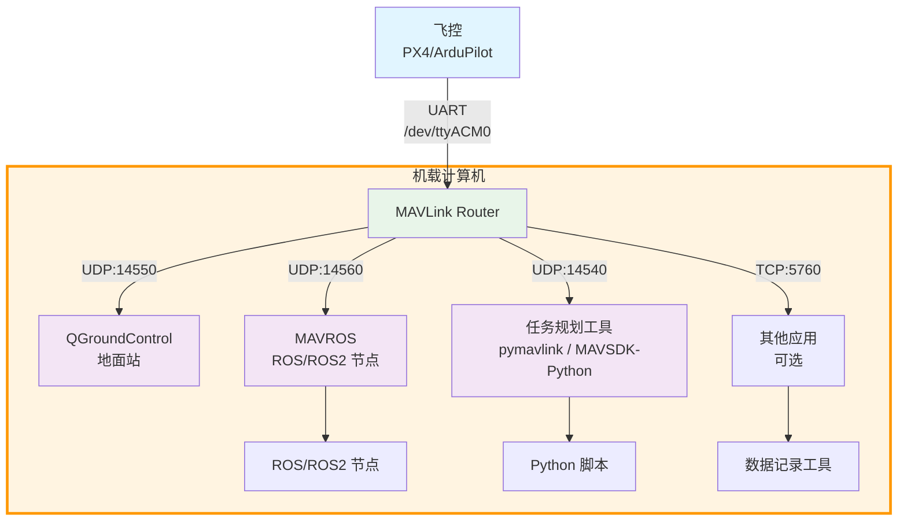

## 1. 概述

MAVLink Router 是一个用于路由 MAVLink 消息的工具，可以在不同的端点（UART、UDP、TCP）之间转发 MAVLink 数据包。在某些 Ubuntu 版本（如 Ubuntu 20.04 Focal）中，可能无法通过 `apt` 直接安装 `mavlink-router` 包，此时需要从源码编译安装。

## 2. 为什么使用 MAVLink Router

### 2.1 优势

MAVLink Router 解决了无人机系统中多个应用同时访问飞控的问题，优势包括：

**多应用并行访问**

在无人机系统中，通常需要多个应用同时与飞控通信：

- **地面站软件**（如 QGroundControl）需要实时显示飞行状态
- **任务规划工具**（如 pymavlink / MAVSDK-Python）需要发送航点任务
- **数据记录工具**需要记录飞行数据
- **自定义应用**需要执行特定功能

由于串口或单一网络连接通常只能被一个应用独占，MAVLink Router 可以将一个物理连接（如串口）转换为多个网络端点，让多个应用同时访问飞控数据。

> **注意**：QGroundControl 的 MAVLink 转发功能可以实现从飞控接收数据，但无法向飞控发送数据，会提示超时错误。如果需要双向通信（如发送航点任务、参数设置等），必须使用 MAVLink Router、MAVProxy 或其他支持双向转发的工具。

**协议转换与桥接**

MAVLink Router 支持在不同传输介质之间桥接：

- **UART ↔ UDP/TCP**：将串口数据转换为网络数据，方便远程访问
- **UDP ↔ TCP**：在不同网络协议之间转换
- **多端点分发**：将一条数据流分发到多个目标

**消息路由与过滤**

- **智能路由**：根据系统 ID 和组件 ID 智能路由消息，避免消息循环
- **消息过滤**：可以过滤特定类型的消息，减少网络负载
- **消息去重**：自动去除重复消息，提高效率

**灵活的网络配置**

- 支持 IPv4 和 IPv6
- 支持单播、多播和广播
- 支持客户端和服务器模式
- 自动检测链路本地地址

### 2.2 典型部署场景

MAVLink Router 在实际应用中有多种部署方式，可以根据具体需求选择机载部署或地面站部署。以下是一个综合的典型部署架构：



**飞控连接（UART）**

飞控通过 UART（如 `/dev/ttyACM0`）连接到机载计算机，波特率通常为 1500000（1.5Mbps）或 921600。需要确保串口权限正确配置（将用户加入 `dialout` 组）。一个串口只能被一个 MAVLink Router 实例使用。如果需要在机载计算机和地面站同时访问，需要在机载计算机上部署 MAVLink Router。串口连接延迟低，适合实时控制应用。

**QGroundControl 连接（UDP:14550）**

QGroundControl 通过 UDP:14550 连接到 MAVLink Router，可以在同一网络内或通过 WiFi/4G 远程连接。QGroundControl 主要用于实时监控飞行状态，接收飞控数据。如果需要发送航点任务，建议使用 pymavlink 或 MAVSDK-Python（通过其他端口）。

> **注意**：QGroundControl 的 MAVLink 转发功能只能接收数据，无法发送数据，会提示超时错误。如果需要双向通信（如发送航点任务、参数设置等），必须使用 MAVLink Router、MAVProxy 或其他支持双向转发的工具。


**任务规划工具连接（UDP:14540）**

pymavlink 或 MAVSDK-Python 通过 UDP:14540 连接到 MAVLink Router，支持双向通信，可以发送航点任务、参数设置等。注意：一个 UDP 端口通常只能被一个应用独占接收使用。如果需要多个应用并行，为每个应用分配不同端口（如 14540、14550、14600）。pymavlink 和 MAVSDK-Python 可以同时使用，但需要连接不同的端口。

**配置示例**：
```bash
# MAVLink Router 配置
mavlink-routerd /dev/ttyACM0:1500000 -e 127.0.0.1:14540 -e 127.0.0.1:14550

# pymavlink 连接
connection = mavutil.mavlink_connection('udp:127.0.0.1:14540')

# MAVSDK-Python 连接
drone = System()
await drone.connect(system_address="udp://:14550")
```

**MAVROS 连接（UDP:14560）**

MAVROS 通过 UDP:14560 连接到 MAVLink Router。MAVROS 是 ROS/ROS2 与 MAVLink 协议之间的桥接节点。配置方式如下：

1. MAVLink Router 配置：

```bash
mavlink-routerd /dev/ttyACM0:1500000 -e 127.0.0.1:14560
```

2. MAVROS 启动（使用命令行参数）：

```bash
ros2 launch mavros px4.launch fcu_url:=udp://:14560@127.0.0.1:14560
```

如果使用 TCP 连接（MAVLink Router 默认监听 TCP:5760），可以使用：

```bash
ros2 launch mavros px4.launch fcu_url:=tcp://127.0.0.1:5760
```

`127.0.0.1:14560` 配置说明：该配置开放给本地的 MAVROS 使用。当外部连接到伴随计算机的 14560 端口时，MAVLink Router 会自动转发 MAVLink 消息到飞控，实现通过 MAVROS 对飞控的直接操作。这样既支持本地 MAVROS 节点访问，也支持远程通过该端口连接并控制飞控。

**使用场景**：
- ROS/ROS2 节点通信：通过 MAVROS 发布/订阅飞控话题
- 传感器融合：将机载传感器数据与飞控数据融合
- 自主导航：ROS 导航栈通过 MAVROS 控制无人机
- 视觉处理：视觉 SLAM 节点获取位置信息并发送控制指令

**注意事项**：
- MAVROS 需要独占一个 UDP 端口
- 可以同时运行多个 ROS 节点共享飞控数据
- 与 ROS 生态系统无缝集成，支持标准的 ROS 话题和服务接口

**其他应用连接（TCP:5760）**

TCP 服务器默认启用，监听端口 5760，支持多个 TCP 客户端同时连接。TCP 连接比 UDP 更可靠，但延迟略高，适合数据记录、远程监控等对可靠性要求高的应用。可以动态连接和断开，不影响其他端点。


## 3. 安装方式选择

### 3.1 使用包管理器安装

在支持的 Ubuntu 版本中，可以直接使用包管理器安装：

```bash
sudo apt update
sudo apt install mavlink-router
```

### 3.2 从源码编译安装

如果在 Ubuntu Focal 等版本中遇到以下错误：

<pre style="color: red;"><code>E: Unable to locate package mavlink-router</code></pre>

则需要从源码编译安装。

## 4. 从源码编译安装

### 4.1 安装依赖

首先安装编译所需的依赖包：

```bash
sudo apt install git meson ninja-build pkg-config gcc g++ systemd
```

### 4.2 克隆源码

```bash
git clone https://github.com/mavlink-router/mavlink-router.git
cd mavlink-router
git submodule update --init --recursive
```

### 4.3 检查并安装 Meson

检查 Meson 版本：

```bash
meson --version
```

如果版本低于 0.55，需要升级：

```bash
pip3 install meson==0.55
```

### 4.4 编译和安装

```bash
meson setup build . && ninja -C build
sudo ninja -C build install
```

## 5. 验证安装

### 5.1 验证安装成功

安装完成后，可以通过以下命令验证 MAVLink Router 是否安装成功：

```bash
mavlink-routerd --help
```

如果能够正常显示帮助信息，说明安装成功。

### 5.2 配置串口权限 - 将用户加入 dialout 组

在使用 MAVLink Router 连接飞控串口之前，需要配置串口权限。

Linux 下所有串口 `/dev/ttyACM*`，`/dev/ttyUSB*` 默认属于 `dialout` 组。将用户加入该组可以一次性解决所有串口权限问题：

```bash
sudo usermod -a -G dialout $USER
```

**重要**：执行上述命令后，必须重启或重新登录系统才能生效：

```bash
reboot
```

重启后检查权限：

```bash
ls -l /dev/ttyACM0
```

应该能看到类似输出：

```text
crw-rw---- 1 root dialout ...
```

此时用户已经在 `dialout` 组里，MAVLink Router 就能访问串口了。

## 6. 命令行使用方法

### 6.1 参数说明

- TCP 服务器默认启用（监听端口 5760）
- TCP 和 UDP 端点可以多次添加
- 使用 `-e` 选项添加的 UDP 端点以普通模式启动（发送数据到指定地址和端口）
- 最后一个参数（无键值）可以是 UART 设备或 UDP 连接，UDP 端点将以服务器模式启动（等待传入连接）

### 6.2 使用示例

#### 从 UART 路由到 UDP

将 MAVLink 数据包从 UART `ttyS1` 路由到 2 个 UDP 端点：

```bash
mavlink-routerd -e 192.168.7.1:14550 -e 127.0.0.1:14550 /dev/ttyS1:1500000
```

其中 `1500000` 是 UART 波特率。

#### 从 UDP 路由到 UDP

也可以从传入的 UDP 连接路由 MAVLink 数据包：

```bash
mavlink-routerd -e 192.168.7.1:14550 -e 127.0.0.1:14550 0.0.0.0:24550
```

#### IPv6 地址格式

IPv6 地址必须用方括号括起来，例如：

```bash
mavlink-routerd -e [::1]:14550 /dev/ttyS1:1500000
```

单播和多播地址都能正确处理，链路本地地址的接口会自动检测。

## 7. 详细说明

### 7.1 端点类型

MAVLink Router 支持三种基本端点类型：UART, UDP 链接和 TCP 客户端。此外，它还可以作为 TCP 服务器为动态客户端提供服务（除非明确禁用）。

#### 7.1.1 UART

- **用途**：用于遥测无线电或其他串行链接
- **配置**：UART 设备路径/名称和波特率
- **行为**：无需等待传入数据即可接收和发送数据

#### 7.1.2 UDP

- **配置**：模式（客户端或服务器）、IP 地址和端口
- **客户端模式行为**：端点配置有目标 IP 和端口组合。启动后可以直接发送 MAVLink 消息，但只有在远程端发送第一条消息后才会接收数据（否则远程端不知道我们的 IP 和端口）
- **服务器模式行为**：端点配置有监听端口和 IP 地址。启动后可以直接接收消息，但只有在收到第一条消息后才能发送消息（否则不知道远程 IP 和端口）。MAVLink 消息总是发送到最后一条传入消息的 IP 和端口

#### 7.1.3 TCP 客户端

- **配置**：目标 IP 地址和端口，断开连接时的重连间隔
- **行为**：TCP 会话建立后立即接收和发送数据

### 7.2 端点定义

端点通过以下方式创建：

1. 在配置文件中定义端点
2. 通过相应的命令行选项定义端点
3. TCP 客户端连接到 TCP 服务器端口

端点在以下情况下被销毁：

1. TCP 客户端从 TCP 服务器端口断开连接
2. MAVLink Router 终止

（这意味着 UART、UDP 和 TCP 客户端端点在运行期间永远不会被销毁）

### 7.3 消息路由

#### 7.3.1 基本路由规则

一般来说，在一个端点上接收的每条消息都会被传递到所有已看到该目标系统/组件的端点。如果是广播消息，则传递到所有端点。消息永远不会发送回它来源的同一端点。

#### 7.3.2 详细路由规则

1. 每个端点会记住在其整个生命周期内从哪些系统（系统 ID 和组件 ID）接收过消息
2. 在一个端点上接收的消息会被提供给除接收端点外的所有端点。端点将：
   - 如果消息的发送者地址在此端点的已连接系统列表中，则拒绝该消息（防止消息循环）
   - 根据出站消息过滤器拒绝消息（如果启用）
   - 如果消息的目标是此端点已连接系统列表中的任何系统，则接受该消息。广播规则在检查目标是否可通过此端点到达时适用。没有目标地址的消息视为广播
   - 如果已连接系统列表为空，则只发送系统 ID 广播消息，不发送组件 ID 广播（因为目标系统未知是否可通过此端点到达）
   - 拒绝所有其他消息

### 7.4 消息过滤

在每个端点上有两个位置可以过滤消息：

- **In（入站）**：在此端点上从外部接收的消息在路由到其他端点之前，根据相应的过滤规则被丢弃或允许
- **Out（出站）**：在传输之前，根据端点的过滤规则丢弃或允许消息。这是在内部路由之后（见上面的`路由规则`章节）

消息过滤器可以基于以下消息标识符之一：

- **MsgId**：基于 MAVLink 消息 ID（如 HEARTBEAT）过滤消息
- **SrcSys**：基于 MAVLink 源系统 ID 过滤消息
- **SrcComp**：基于 MAVLink 源组件 ID 过滤消息

消息过滤器可以是阻止列表或允许列表：

- **Block（阻止）**：丢弃所有匹配相应标识符的消息（允许所有其他消息）
- **Allow（允许）**：允许所有匹配相应标识符的消息（丢弃所有其他消息）

注意：在同一标识符上同时使用 `Allow` 和 `Block` 过滤器没有意义，但在不同标识符上使用它们可能很有用（例如，只允许特定的出站系统 ID，并阻止该系统发送一些不需要的消息 ID）。

### 7.5 消息去重

如果启用，每条传入消息都会被检查，是否在过去 `DeduplicationPeriod` 毫秒内已经收到过另一个副本。如果已知，消息将被丢弃，就像从未收到过一样，该消息的超时计数器将被重置。消息通过包括其标头在内的完整 MAVLink 消息的 `std::hash` 值进行标识。

只要在配置的周期内没有收到具有完全相同标头序列号和内容的消息，一切正常。最关键的消息是心跳，因为它主要包含静态数据。因此，周期短于最快静态消息的更新周期在任何情况下都可以（对于 1 Hz 心跳，小于 1000 毫秒）。

### 7.6 端点组

可以将多个端点配置为在同一端点组中。同一组中的端点将共享相同的已连接系统列表。

当使用两个（或更多）并行数据链路时（例如 LTE 和遥测无线电），端点必须在两侧都分组。否则，由于路由规则 1，一个链路将不再被使用。

### 7.7 消息嗅探

可以通过设置 `SnifferSysID` 来定义嗅探器。这将把所有流量转发到连接了此 MAVLink 系统 ID 的端点。这可用于记录或查看流经 mavlink-router 的所有消息。

---

## 参考文档

- [MAVLink Router GitHub 仓库](https://github.com/mavlink-router/mavlink-router)
