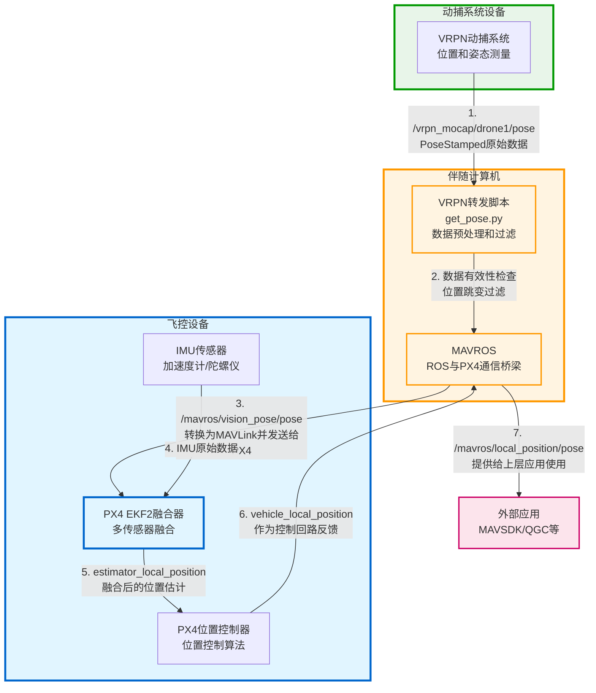
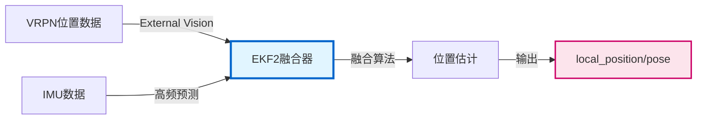
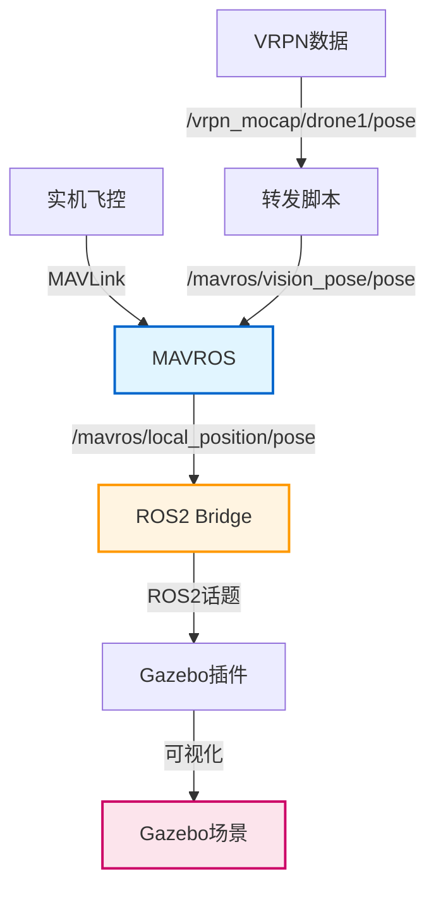
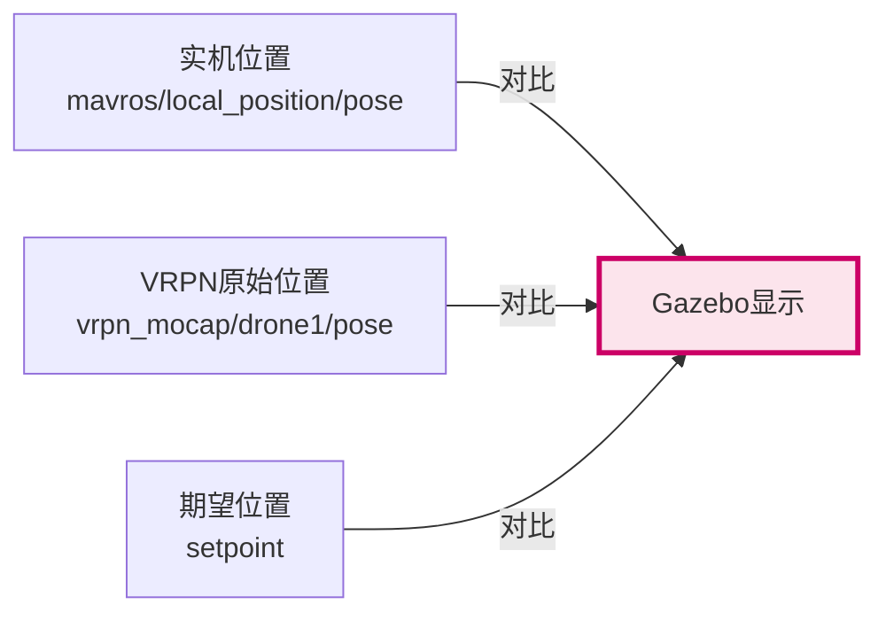
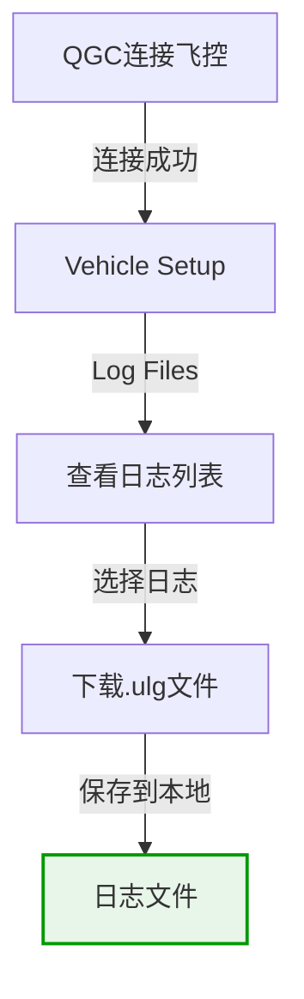
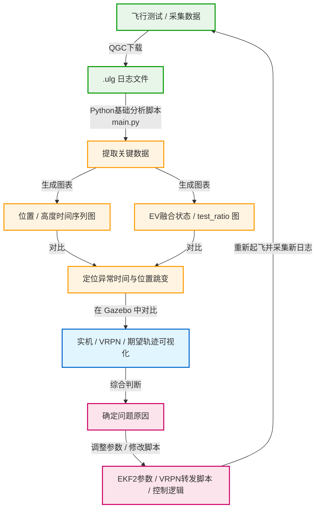

本文档**不**包含 `ROS 2`, `MAVROS`, `Gazebo` 等工具的基础使用方法，也没有如何安装、编译或运行这些软件的具体步骤；
而是**专注于：VRPN 位姿数据是如何进入系统、在各个设备中如何被处理与融合、以及如何通过日志和脚本分析这些数据**。

- 阅读本文档默认你已经具备以下基础能力：
- 能够在自己的环境中安装并使用 `ROS 2`, `MAVROS` 和 `Gazebo`
- 能够启动 `PX4` 飞控, `QGroundControl`，并、完成连接
- 能够运行简单的 Python 脚本和 `ROS` / `ROS 2` 节点命令


## 1. 飞控的数据融合流程：从 VRPN 到位置融合数据

### 1.1 完整数据流

VRPN 动捕系统的位置和姿态数据经过多个环节处理，最终融合到飞控的位置估计中。整个系统涉及三个主要设备：**动捕系统**，**伴随计算机** 和 **飞控**。



**设备功能说明**：

| 设备 | 运行的功能 | 说明 |
|------|-----------|------|
| **动捕系统** | VRPN动捕系统 | 提供高精度位置和姿态测量数据 |
| **伴随计算机** | VRPN转发脚本 | 数据预处理、有效性检查、位置跳变过滤 |
| **伴随计算机** | MAVROS | ROS话题与MAVLink消息转换，与飞控通信 |
| **飞控** | IMU传感器 | 提供加速度和角速度数据（硬件） |
| **飞控** | PX4 EKF2融合器 | 融合VRPN和IMU数据，输出位置估计 |
| **飞控** | PX4位置控制器 | 基于位置估计进行飞行控制 |

### 1.2 关键话题说明

| 话题名称 | 类型 | 说明 | 数据来源 |
|---------|------|------|---------|
| `/vrpn_mocap/drone1/pose` | `geometry_msgs/PoseStamped` | VRPN原始数据 | VRPN动捕系统 |
| `/mavros/vision_pose/pose` | `geometry_msgs/PoseStamped` | 转发给PX4的VRPN数据 | MAVROS |
| `/mavros/local_position/pose` | `geometry_msgs/PoseStamped` | **EKF2融合后的最终位置** | PX4 EKF2 |

### 1.3 视觉转发脚本

在伴随计算机上，需要一个“视觉转发脚本”`get_pose.py`，负责把动捕系统输出的位姿数据转换成飞控可以理解的形式，并转发给MAVROS。  
可以简单理解为：**MAVROS是 ROS ↔ PX4 的桥，而 `get_pose.py` 则是 VRPN ↔ MAVROS 的桥**——负责在进入 MAVROS 之前，把视觉数据清洗、规范好。  
其功能可以概括为：

1. 订阅动捕系统的位姿话题（例如 `/vrpn_mocap/drone1/pose`，类型为`geometry_msgs/PoseStamped`）。  
2. 检查数据有效性：过滤掉包含 NaN、无穷大或严重不合法四元数的数据。  
3. 限制位置跳变：如果相邻两帧的位置差异超过阈值（如 0.5 m），认为数据异常并丢弃。  
4. 可选：限制数据超时，如果长时间收不到新数据，则暂停转发，避免向飞控提供过期数据。  
5. 转发到MAVROS：将清洗后的位姿发布到 `/mavros/vision_pose/pose`，并将 `frame_id` 统一设为 `map` 坐标系，供飞控 EKF2 使用。  
6. 可选：记录日志，将实际转发的数据写入日志文件，方便之后用 Python 分析。

下面是一个基于 `rospy` 的简化示例，展示 `get_pose.py` 的核心逻辑（省略异常处理和完整启动代码）：

```python
#!/usr/bin/env python3
import rospy
from geometry_msgs.msg import PoseStamped
import math


class VisionRelay(object):
    def __init__(self):
        # 最大允许位置跳变（米）
        self.max_position_change = rospy.get_param("~max_position_change", 0.5)
        self.last_pose = None

        # 订阅 VRPN 动捕位姿
        self.sub = rospy.Subscriber(
            "/vrpn_mocap/drone1/pose",
            PoseStamped,
            self.pose_callback,
            queue_size=10,
        )

        # 发布到 MAVROS，供飞控 EKF2 使用
        self.pub = rospy.Publisher(
            "/mavros/vision_pose/pose",
            PoseStamped,
            queue_size=10,
        )

    def _is_pose_valid(self, pose):
        """检查位置和四元数是否有效"""
        p = pose.position
        q = pose.orientation

        # 1）检查 NaN / Inf
        for v in (p.x, p.y, p.z, q.x, q.y, q.z, q.w):
            if math.isnan(v) or math.isinf(v):
                return False

        # 2）检查四元数近似归一化
        q_norm = math.sqrt(q.x**2 + q.y**2 + q.z**2 + q.w**2)
        if abs(q_norm - 1.0) > 0.1:
            return False

        return True

    def _position_jump_too_large(self, new_pose):
        """检查与上一帧相比是否位置跳变过大"""
        if self.last_pose is None:
            return False

        p1 = self.last_pose.pose.position
        p2 = new_pose.pose.position
        dx = p2.x - p1.x
        dy = p2.y - p1.y
        dz = p2.z - p1.z
        dist = math.sqrt(dx * dx + dy * dy + dz * dz)
        return dist > self.max_position_change

    def pose_callback(self, msg):
        """接收 VRPN 位姿并进行过滤，再转发到 MAVROS"""
        if not self._is_pose_valid(msg.pose):
            # 丢弃无效数据
            return

        if self._position_jump_too_large(msg):
            # 丢弃位置跳变过大的数据
            return

        # 通过检查，更新 last_pose
        self.last_pose = msg

        # 转发到 MAVROS，这里主动将 frame_id 规范到 \"map\" 坐标系
        # 这样可以避免动捕系统原始 frame_id (如 \"world\" / 机体名等) 与 PX4/MAVROS 期望的全局坐标系不一致，
        # 方便在下游（EKF2、本地位置话题、可视化工具）中进行统一的坐标变换和调试。
        out = PoseStamped()
        out.header.stamp = msg.header.stamp
        out.header.frame_id = "map"
        out.pose = msg.pose
        self.pub.publish(out)


if __name__ == "__main__":
    rospy.init_node("vision_relay")
    node = VisionRelay()
    rospy.spin()
```

无论使用 ROS1（`rospy`）还是 ROS2（`rclpy`），关键点都是：**订阅 VRPN 位姿 → 进行数据过滤 → 以 `/mavros/vision_pose/pose` 的形式转发给 MAVROS**，从而让飞控的 EKF2 接收到可靠的视觉位姿输入。

### 1.4 PX4 参数配置：使用视觉+IMU 进行EKF2融合

要让飞控真正使用视觉位置和高度，需要在 PX4 中正确配置 EKF2 相关参数，使其融合 External Vision（EV）和自身 IMU，并在需要时停用 GPS 融合。下面给出一个典型的配置思路（以 QGroundControl 参数界面为例）：

1. **启用视觉位置融合（EKF2_AID_MASK）**  
   - 在 QGC 中搜索参数 `EKF2_AID_MASK`。  
   - 确保勾选/包含：  
     - Vision position（视觉位置）  
     - （可选）Vision yaw（视觉航向），如果动捕系统提供可靠的 yaw。  
   - 如果不希望使用 GPS：取消 GPS position、GPS yaw 等相关选项，或者直接在飞控硬件上不接 GPS。  

2. **选择高度来源（EKF2_HGT_MODE / EKF2_EV_CTRL）**  
    - 将 `EKF2_HGT_MODE` 设置为 Vision / External Vision（具体名称取决于 PX4 版本）。  
    - 在 `EKF2_EV_CTRL` 中启用高度相关融合选项（position + height）。  

3. **合理设置视觉噪声参数（EKF2_EV_POS_X / EKF2_EV_POS_Y 等）**  
   - 在日志分析中，如果发现视觉数据经常被拒绝（test_ratio 很大），说明噪声参数过小或门限过严。  
   - 通常可以将：  
     - `EKF2_EV_POS_X` / `EKF2_EV_POS_Y` 从 0.1 调整到 0.3–0.5。  
     - `EKF2_EVP_NOISE` 调整到与 EV_POS_X/Y 相近的数值。  
     - `EKF2_EVP_GATE` 调整到 5–7 之间，允许合理的残差。  

4. **只保留需要的传感器融合**  
   - 确保 `EKF2_AID_MASK` 中只启用你实际在用的传感器（IMU 必须，视觉按需，GPS 可停用）。  
   - 这样可以避免 EKF2 在 GPS 和视觉之间来回切换，导致位置跳变。  

5. **保存参数并重启飞控**  
   - 修改完参数后，在 QGC 中保存参数并重启飞控，让新的融合配置生效。  

完成以上配置后，EKF2 应当可以以 IMU 为高频预测源，以视觉位姿为慢速绝对参考，在无 GPS 的环境中完成稳定的位置和高度融合。

### 1.5 EKF2融合过程

EKF2（Extended Kalman Filter 2）是PX4的核心融合算法，将VRPN数据与IMU数据融合：



**融合步骤**：

1. **IMU预测阶段**：使用IMU数据（加速度计、陀螺仪）以高频（~200Hz）预测位置和姿态
2. **VRPN更新阶段**：接收VRPN数据，计算innovation（预测值与测量值的差）
3. **数据有效性检查**：计算test_ratio，如果超过阈值则拒绝数据
4. **状态更新**：融合有效数据，更新位置和姿态估计

### 1.6 验证融合

**检查 `/mavros/local_position/pose` 话题输出**：

```bash
# 检查话题是否存在
rostopic list | grep local_position

# 检查话题频率（应该>10Hz）
rostopic hz /mavros/local_position/pose

# 查看话题内容
rostopic echo /mavros/local_position/pose
```

**正常输出示例**：

```text
header:
  seq: 12345
  stamp:
    secs: 1234567890
    nsecs: 123456789
  frame_id: "map"
pose:
  position:
    x: 1.234
    y: 2.345
    z: -0.567
  orientation:
    x: 0.0
    y: 0.0
    z: 0.0
    w: 1.0
```

如果话题有正常输出且频率>10Hz，说明VRPN数据已成功融合到飞控位置信息中。  
只要你使用 MAVROS 并持续发布：

```bash
rostopic echo /mavros/vision_pose/pose
```

MAVROS 会自动将其转换为 MAVLink 的 `VISION_POSITION_ESTIMATE`，在 EKF2 参数配置正确（例如 `EKF2_AID_MASK` 中启用 Vision 相关选项）的前提下，EKF2 就会融合这些视觉数据，并通过 `/mavros/local_position/pose` 话题输出。

## 2. 融合结果验证与快速排查

### 2.1 使用 MAVROS 话题快速确认 EKF2 输出

当怀疑 EKF2 没有正确融合 VRPN 视觉数据时，可以先用 MAVROS 话题做一个“最小自检”：

```bash
# 直接查看局部位置输出
rostopic echo /mavros/local_position/pose

# 检查话题频率（建议 >10Hz）
rostopic hz /mavros/local_position/pose

# 查看话题信息，确认发布者与消息类型
rostopic info /mavros/local_position/pose
```

如果 `/mavros/local_position/pose` 话题不存在、频率明显偏低，或者数据长时间不更新，说明 EKF2 融合过程存在问题，需要进一步检查 PX4 内部状态和日志。

如果 `/mavros/vision_pose/pose` 话题不存在，说明 get_pose.py 脚本运行存在问题，需要进一步检查和调试。

### 2.2 检查 PX4 EKF2 状态与常见失败原因

PX4 内部通过 uORB 话题提供 EKF2 的详细状态与告警信息，可以直接在 ROS2 环境下查看：

```bash
# 查看 EKF2 的时间戳信息（是否在正常更新）
ros2 topic echo /fmu/out/ekf2_timestamps

# 查看 EKF2 估计器状态（融合标志、test_ratio 等）
ros2 topic echo /fmu/out/estimator_status
```

在 `estimator_status` 中，重点关注以下几个方面：

- **Innovation Test Ratios**：各传感器的残差检验值，如果长期明显大于 1，说明该传感器数据经常被拒绝，可能存在噪声模型或数据质量问题。
- **Control Status / Fusion Flags**：哪些传感器被真正纳入融合（如 GPS、视觉位置、气压高度等），可用来确认视觉融合是否已实际启用。
- **告警与错误信息**：PX4 会通过状态位和日志给出融合失败的直接原因。

常见 EKF2 融合失败原因包括：

- GPS 信号丢失或不稳定（但参数中仍启用 GPS 融合，导致状态在 GPS/视觉间频繁切换）。
- IMU 数据异常（震动过大、传感器损坏或安装不当）。
- 磁力计干扰或偏差过大（航向不可靠，影响位置估计）。
- 参数配置错误（例如 `EKF2_AID_MASK` 未启用 Vision Position，或高度来源与实际数据来源不一致）。

### 2.3 结合日志与 Flight Review 做进一步确认

如果通过话题和 uORB 状态仍无法快速判断问题根因，可以进一步查看 PX4 记录的 `.ulg` 日志：

1. 使用 QGroundControl 下载 `.ulg` 日志文件（参考后文“4.1 QGroundControl日志下载”）。  
2. 使用 QGroundControl 自带的日志浏览器或 Flight Review 网站打开日志。  
3. 在日志中重点查看 `Estimator Status / EKF2` 相关曲线：
   - **Innovation Test Ratios**：确认视觉位置、气压高度、IMU 等传感器的残差是否在合理范围。
   - **Control Status / Fusion Flags**：确认 External Vision 是否真正被纳入融合，而不是一直处于“待用”或“拒绝”状态。
   - **Warning / Error 信息**：例如 `GPS quality insufficient`，`Mag fusion failed`，`Bad IMU data` 等。

通过“话题自检 + uORB 状态 + 日志回放”这一套组合排查，可以较快定位是**传感器数据本身的问题**（如动捕数据不稳定、IMU 噪声过大）、**参数配置错误**，还是**EKF2 内部对某类数据一直处于拒绝状态**。

## 3. 可视化验证：Gazebo中的位置监控

### 3.1 系统架构

使用Gazebo仿真环境和ROS2 bridge，可以实时可视化飞机的位置和姿态，对比实机位置数据与仿真显示：




### 3.3 Gazebo可视化插件

创建Gazebo插件订阅飞机位置话题，在Gazebo场景中显示飞机模型：

```xml
<!-- Gazebo模型文件示例 -->
<model name="drone1">
  <pose>0 0 0 0 0 0</pose>
  <static>false</static>
  <plugin name="pose_visualizer" filename="libpose_visualizer.so">
    <ros2_topic>/mavros/local_position/pose</ros2_topic>
    <update_rate>50</update_rate>
  </plugin>
</model>
```

### 3.4 位置数据对比

在Gazebo中可以同时显示：

1. **实机位置**：来自`/mavros/local_position/pose`（EKF2融合后的位置）
2. **VRPN原始位置**：来自`/vrpn_mocap/drone1/pose`（动捕系统原始数据）
3. **期望位置**：来自位置控制器setpoint



**观察要点**：

- **位置差异**：实机位置与VRPN原始位置的差异反映了EKF2融合的效果
- **姿态差异**：如果姿态显示不一致，可能是EKF2融合或IMU数据问题
- **延迟**：观察数据更新的延迟，如果延迟过大可能影响控制性能
- **跳变**：如果位置突然跳变，可能是数据过滤失效或EKF2融合异常

## 4. 异常诊断：使用 pyulog 库分析飞控日志

### 4.1 QGroundControl日志下载

当发现位置异常或融合问题时，需要下载飞行日志进行分析。

#### 4.1.1 连接飞控

1. 打开QGroundControl（QGC）
2. 通过USB或无线连接飞控
3. 等待连接建立（状态栏显示"Connected"）

#### 4.1.2 下载日志文件



**操作步骤**：

1. 在QGC主界面，点击左上角菜单 → **Vehicle Setup**
2. 选择 **Log Files** 标签页
3. 查看日志列表，选择需要分析的日志（通常是最新的）
4. 点击 **Download** 按钮下载
5. 日志文件保存为`.ulg`格式

**日志文件命名**：
- 格式：`log_XXX_YYYY-MM-DD-HH-MM-SS.ulg`
- 例如：`log_287_2025-11-25-05-30-36.ulg`

### 4.2 Python脚本分析工具

使用Python脚本解析`.ulg`文件，提取关键数据并生成可视化图表。

#### 4.2.1 安装依赖

```bash
# 安装pyulog库（用于解析.ulg文件）
pip install pyulog

# 安装其他依赖
pip install numpy matplotlib pandas
```

#### 4.2.2 基础分析脚本

下面是一个简单的分析脚本示例：
从 `.ulg` 日志中读取 EKF 内部估计位置（`estimator_local_position`）和融合后对外发布的位置（`vehicle_local_position`）。  
在一张图上绘制二者的 X/Y/Z 三轴曲线对比图并保存为PNG文件，同时在终端打印保存信息。

```python
from pyulog import ULog
import matplotlib.pyplot as plt


# 这里直接指定需要分析的 ulog 文件
ulog_file = 'log_284_2025-11-25-01-15-04.ulg'

# 从文件名中提取「ulog 编号」（例如 log_0_2025-... -> log_0）
base_name = ulog_file.split('.')[0]
ulog_id = '_'.join(base_name.split('_')[:2])
output_png = f'{ulog_id}.png'

# 读取日志
ulog = ULog(ulog_file)

# 获取 EKF 估计位置
try:
    elp = ulog.get_dataset('estimator_local_position0')
except Exception:
    elp = ulog.get_dataset('estimator_local_position')

# 获取 vehicle_local_position
vlp = ulog.get_dataset('vehicle_local_position')

# 时间戳（秒）
t_el = elp.data['timestamp'] / 1e6
t_vl = vlp.data['timestamp'] / 1e6

# 位置数据
x_el = elp.data['x']
y_el = elp.data['y']
z_el = elp.data['z']

x_vl = vlp.data['x']
y_vl = vlp.data['y']
z_vl = vlp.data['z']

# 只做 XYZ 对比并输出图片
fig, axes = plt.subplots(3, 1, figsize=(12, 10), sharex=True)

# X
ax = axes[0]
ax.plot(t_el, x_el, label='estimator_local_position.x', alpha=0.7)
ax.plot(t_vl, x_vl, label='vehicle_local_position.x', alpha=0.7)
ax.set_ylabel('X (m)')
ax.legend()
ax.grid(True, alpha=0.3)

# Y
ax = axes[1]
ax.plot(t_el, y_el, label='estimator_local_position.y', alpha=0.7)
ax.plot(t_vl, y_vl, label='vehicle_local_position.y', alpha=0.7)
ax.set_ylabel('Y (m)')
ax.legend()
ax.grid(True, alpha=0.3)

# Z
ax = axes[2]
ax.plot(t_el, z_el, label='estimator_local_position.z', alpha=0.7)
ax.plot(t_vl, z_vl, label='vehicle_local_position.z', alpha=0.7)
ax.set_ylabel('Z (m)')
ax.set_xlabel('Time (s)')
ax.legend()
ax.grid(True, alpha=0.3)

plt.tight_layout()
plt.savefig(output_png, dpi=150)
print(f'图表已保存为 {output_png}')

plt.show()

```


### 4.3 执行分析



在图示流程中，当通过日志分析、Gazebo 可视化完成参数调整或问题修复后，**应当重新回到流程起点（从新一轮飞行测试与日志采集开始）**，形成闭环迭代的调试过程。

### 4.4 分析调试过程案例

本节展示的是**同一套系统在同一场景下的三轮重复测试与分析过程**：每次起飞都记录 `.ulg` 日志，用前文的 Python 脚本生成三轴位置对比图，逐步调整参数与脚本，直到 `estimator_local_position` 与 `vehicle_local_position` 的 X/Y/Z 曲线基本重合。

#### 第一次测试：log_284——初步评估

`log_284` 是该案例中的第一次测试飞行，通过 Python 分析脚本生成的三轴位置对比图如下：


你可以下载对应的原始 `.ulg` 日志文件以便自行复现分析过程：

- [log_284_2025-11-25-01-15-04.ulg](/Docsy/files/log_284_2025-11-25-01-15-04.ulg)

在 `log_284` 中可以看到：在切换到 `Position` 模式之前，`estimator_local_position` 与 `vehicle_local_position` 的三轴曲线基本重合，XYZ 一致性良好，说明 EKF2 内部状态与对外发布的位置估计在非 `Position` 模式下工作正常。  
当通过 QGC 将飞控切换到 `Position` 模式后，图中的 X/Y 轴曲线开始出现明显的锯齿状位置跳变，飞控开始拒绝超范围的位置输入，平面位置估计在相邻采样之间快速来回抖动，最终导致控制回路输出剧烈变化，飞机进入失控状态。

**问题原因分析**：

1. **Position 模式下的控制回路反馈振荡**：在 `Position` 模式下，位置控制器会读取 `vehicle_local_position` 作为反馈信号，计算位置误差并生成控制指令。当位置估计不稳定时，会形成反馈循环：EKF2 内部估计（`estimator_local_position`）出现波动 → 位置控制器基于不稳定的位置反馈产生控制指令 → 控制指令导致飞机实际运动，进一步影响位置估计 → 形成振荡反馈，导致锯齿状跳变。这解释了为什么问题只在切换到 `Position` 模式后才暴露出来。

2. **EKF2 数据拒绝机制导致的间歇性跳变**：EKF2 的 innovation test 会计算预测值与测量值的残差（innovation），如果 `test_ratio` 超过门限（如 `EKF2_EVP_GATE`），会拒绝该次视觉数据。视觉数据被拒绝时，EKF2 只能依赖 IMU 进行预测，位置逐渐漂移；下次视觉数据被接受时，位置突然"跳回"到正确值。这种"拒绝-接受"的切换导致位置曲线出现锯齿状跳变。在 `log_284` 中，由于视觉噪声参数（`EKF2_EV_POS_X/Y`）设置过小，视觉数据频繁被拒绝，导致锯齿状跳变非常明显。

3. **两个位置数据源的不同处理逻辑**：`estimator_local_position` 是 EKF2 内部状态，相对平滑但可能有延迟；`vehicle_local_position` 是经过位置控制器和范围限制处理后的对外发布值。当 EKF2 内部估计与控制器期望不一致时，`vehicle_local_position` 可能被限制或修正，导致两者出现偏差。在 `log_284` 中，两个曲线"打架"的情况正是这种处理逻辑差异的体现。

这一轮测试为后续调试建立了清晰的"问题基线"——**问题只在 `Position` 模式下暴露，且主要集中在平面位置 X/Y 的估计质量上**。

#### 第二次测试：log_286——参数调整

在第二次测试 `log_286` 中，在飞行前对 `EKF2_EV_POS_X`，`EKF2_EV_POS_Y` 等视觉噪声参数以及相关 innovation gate（`EKF2_EVP_GATE`）进行了调整，希望减少视觉数据被拒绝的次数，并改善 EKF2 对外发布的位置输出质量：


对应的原始日志文件为：

- [log_286_2025-11-25-04-42-44.ulg](/Docsy/files/log_286_2025-11-25-04-42-44.ulg)

对比 `log_284` 与 `log_286` 的分析图可以看到：在切换到 `Position` 模式时，X/Y 轴上虽然依然存在大量锯齿状跳变，但 `estimator_local_position` 与 `vehicle_local_position` 在两个平面轴上的轨迹已经基本重合，不再出现前一轮测试中那种明显彼此"打架"的情况。

**改进原因分析**：

通过调整 `EKF2_EV_POS_X/Y` 和 innovation gate（`EKF2_EVP_GATE`），减少了视觉数据被 EKF2 拒绝的频率。在 `log_284` 中，由于视觉噪声参数设置过小，EKF2 的 innovation test 频繁拒绝视觉数据，导致位置在"IMU 预测漂移"和"视觉数据跳回"之间快速切换，形成锯齿状跳变。参数调整后，虽然仍有跳变（说明问题尚未完全解决），但两个位置曲线已经基本重合，说明视觉数据被拒绝的频率显著降低，EKF2 内部状态与对外发布的位置估计已经趋于一致。

这表明视觉测量与 EKF2 内部状态本身是一致的，问题更可能来自当前 PX4 固件版本或其他高级参数配置，而不是 VRPN 数据链路或噪声模型本身。

#### 第三次测试：log_287——融合效果收敛

第三次测试 `log_287` 展示的是在前两次测试基础上，**更换 PX4 固件版本、重新配置 EKF2 相关参数并完成电机与遥控器校准之后**，系统运行较为稳定的一次飞行：


你可以下载该次飞行的日志文件进行进一步分析：

- [log_287_2025-11-25-05-30-36.ulg](/Docsy/files/log_287_2025-11-25-05-30-36.ulg)

在这次飞行中，从姿态控制到切换到 `Position` 模式的整个过程中，XYZ 三轴的 `estimator_local_position` 与 `vehicle_local_position` 曲线始终平滑且高度重合，X/Y 轴不再出现锯齿状位置跳变，`Position` 模式下飞行轨迹稳定可控，高度曲线也未出现明显漂移或突变。


通过三次测试的逐步改进，验证了问题的根本原因和解决方案：

1. **参数调整的作用**（log_286）：通过调整 `EKF2_EV_POS_X/Y` 和 innovation gate（`EKF2_EVP_GATE`），减少了视觉数据被拒绝的频率，使两个位置曲线基本重合，证明了参数配置的重要性。

2. **固件升级与完整校准的协同效果**（log_287）：更换 PX4 固件版本、重新配置 EKF2 参数并完成传感器校准后，彻底消除了锯齿状跳变。这说明问题不仅来自参数配置，也可能与固件版本的位置处理逻辑有关。新固件版本可能修复了 Position 模式下的位置处理逻辑问题，或者优化了 EKF2 与位置控制器之间的接口，使得两个位置数据源能够更好地同步。

3. **控制回路反馈振荡的消除**：在 `log_287` 中，由于位置估计稳定，Position 模式下的控制回路不再出现振荡反馈。位置控制器能够基于稳定的位置反馈产生平滑的控制指令，避免了锯齿状跳变。

4. **数据拒绝机制的优化**：通过参数调整和固件升级，EKF2 的 innovation test 能够更准确地评估视觉数据的质量，减少了不必要的拒绝，使得位置估计更加连续和平滑。

结合 Gazebo 可视化，对比 `/mavros/local_position/pose` 与 `/vrpn_mocap/drone1/pose` 可以看到，VRPN 融合后的整体轨迹与动捕原始轨迹保持一致。  
通过这一个案例的三次测试与分析，可以将"日志采集 → Python 分析 → 参数/脚本调整 → 重新飞行验证"的闭环流程具体化，直到最终实现三轴位置曲线的高度重合，方便在后续调试中快速套用同样的方法。

---

## 参考文档

- [PX4 User Guide - External Vision](https://docs.px4.io/main/en/ros/external_position_estimation.html)
- [PX4 User Guide - EKF2 Tuning Guide](https://docs.px4.io/main/en/advanced_config/tuning_the_ecl_ekf.html)
- [MAVROS 官方文档](https://github.com/mavlink/mavros)
- [ROS 1 rostopic 命令参考](https://wiki.ros.org/rostopic)
- [ROS 2 CLI 工具参考](https://docs.ros.org/en/foxy/Concepts/About-Command-Line-Tools.html)
- [Gazebo 官方文档](https://gazebosim.org/docs)
- [VRPN - Virtual-Reality Peripheral Network](https://github.com/vrpn/vrpn)
- [Flight Review 日志分析网站](https://logs.px4.io/)
- [pyulog GitHub 仓库](https://github.com/PX4/pyulog)

