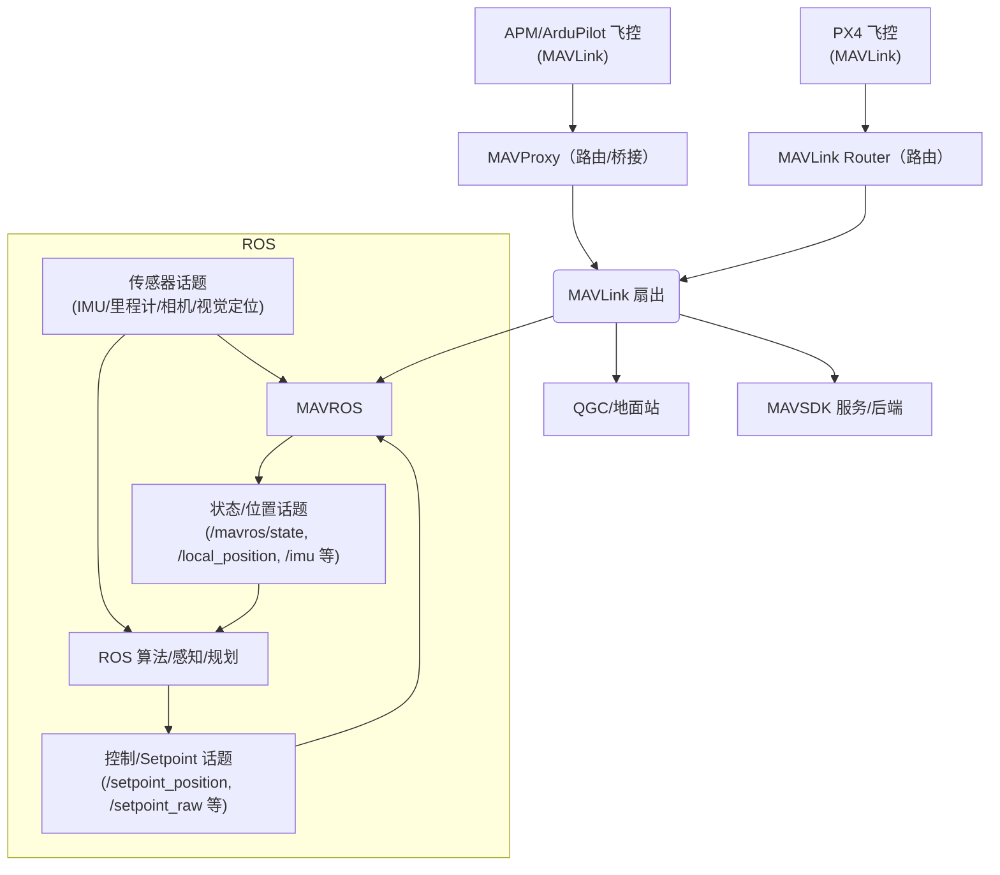

本文围绕 ArduPilot/APM 飞控平台，系统梳理 MAVROS 与 MAVProxy 的定位、工作原理、典型使用场景、差异点与组合策略，并评估在不同任务形态下它们的必要性以及可替代方案。

 - 只需“把数据给多人看/多服务用”：用 MAVProxy（或 MAVLink Router）。
 - 需要“在 ROS 内做算法并控制飞机”：用 MAVROS；若还要多路分发，再叠加 MAVProxy。
- 面向 APM 的通用稳健方案：APM → MAVLink 路由工具 →（QGC | MAVROS | MAVSDK...）。

## 1. 概念

- **MAVLink**：飞控与外部系统之间的轻量级消息协议。消息是结构化的二进制帧，包含系统/组件 ID、消息 ID、序号、时间戳等；通过串口或 UDP/TCP 承载。关键点是“谁与谁在对话、以何种传输介质与频率对话”。
- **APM/ArduPilot**：在飞控端负责生成/消费 MAVLink 消息（心跳、状态、位置、参数、模式、任务、RCIO 等）；可配置消息流速率与输出端口。
- **典型链路**：飞控串口/UDP → 路由/桥接（可选） → 地面站/算法/服务。路由关注“扇入/扇出与可靠转发”，桥接关注“协议域间的语义映射（如 MAVLink↔ROS）”。

## 2. MAVProxy：MAVLink 路由工具

### 2.1 概念

- **定位**：轻量“地面站/路由工具”。核心目标是“从一个或多个输入稳定扇出到多个输出”，不改变 MAVLink 协议语义；由 ArduPilot 官方维护。
- **职责边界**：以路由/转发为核心能力，其他能力按需启用。

### 2.2 工作机制

- 输入（master）：显式指定串口或 UDP/TCP 源，只转发声明的输入。
- 输出（out）：可并行配置多个 UDP/TCP 目的端，逐帧复制转发。
- 流控（streamrate）：向飞控申请消息组频率；需与其他客户端协同，避免相互抢写导致抖动。
- 插件化：按需加载日志、地形、地理围栏、仿真辅助等模块。
- 功能要点：
  - 稳定扇出与可观测：输出目的端清晰，异常易于定位（心跳/计数异常等）。
  - 低侵入与易部署：无需 ROS/DDS 等环境，常驻机载计算机做统一扇出。
  - 直接交互飞控：读写参数、切换模式、解锁/上锁。
  - 任务/航点：任务上传下载与流程管理。
  - 速率管理：统一申请与调整消息组频率，控制链路负载。
  - 日志记录：事件/日志输出，便于复现与追踪。
  - 地理与仿真：地理围栏、地形数据、SITL/联调辅助。

> 注意：关于 QGC 的 MAVLink 转发
>
> QGC 的“MAVLink 转发”仅会将“QGC 接收到的 MAVLink 帧”单向转发到目标地址；它不会把来自该目标地址的控制/参数写入等指令再回送给飞控。因此，经由 QGC 转发链路发送控制命令通常会因无法到达飞控而超时。若需要可控的双向链路，请在飞控侧或近端使用 MAVProxy、MAVLink Router 等路由工具建立端到端会话。

### 2.3 典型使用场景

- 多下游并发：同一飞控流同时提供给 QGC、MAVSDK 服务、日志录制、状态监控。
- 网络解耦：在不改飞控输出的前提下，本机扇出多路流。
- 安全隔离：结合端口控制与防火墙/ACL 管控可达范围。
- 多飞控集中接入：一台伴随计算机统一接入多块飞控，集中扇出与会话管理。
- 蜂群/编队分发：为编队提供稳定的遥测与指令分发通道，易于规模化监控。
- 异构链路聚合：串口/UDP/蜂窝/以太网等多链路统一转发与限流。
- 伴随端常驻：作为“入口与分发”常驻机载，向地面站、算法、日志稳定供数。
- 诊断与复现：配合日志/事件与可观测性指标，快速定位断流、环路与高负载。

### 2.4 优势与局限

- 优势：简单可靠、部署门槛低、与 APM 生态契合度高、职责边界清晰。
- 局限：无语义映射与高层控制 API；需配合其他组件完成算法/定位/融合。

### 2.5 MAVProxy 与 PX4

- MAVProxy 是基于 MAVLink 协议层的路由/地面站工具，由 ArduPilot 社区维护；并非 APM 专属。任何产出/消费 MAVLink 的系统（APM、PX4、SITL、外设网关等）都可接入与转发。
- PX4 官方推荐在机载计算机侧采用其自有框架与工具链进行路由/桥接，例如 MAVLink Router（推荐）或基于 microROS/uXRCE-DDS 的通信栈，而非 MAVProxy。本推荐见 PX4 官方“机载电脑”文档。
- MAVProxy 能够稳定转发 PX4 的遥测与指令流；实际工程中仍应优先评估 PX4 推荐方案，只有在需要命令行交互、插件生态与现场诊断等特性时再考虑使用 MAVProxy。
- 建议：
  - 以 PX4 官方支持路径、长期维护与系统服务形态为优先：倾向 MAVLink Router 或 uXRCE-DDS。
  - 需要命令行交互、插件能力与快速诊断：可选 MAVProxy（注意协调 SYSID/COMPID、速率与签名/隔离策略）。
- 注意：对 PX4 而言，MAVProxy“可用但非官方推荐/非必要”；对 APM 生态契合度最高，但并非唯一可选的路由工具。

## 3. MAVROS：ROS↔MAVLink

### 3.1 概念

- MAVROS 是 ROS 的一个软件包，用于在 ROS 与支持 MAVLink 的飞控之间进行通信与语义映射；是连接 ROS 与 PX4/APM 的关键桥梁，使开发者可直接在 ROS 中以话题/服务的形式使用飞控能力。
- 若不使用 MAVROS，开发者需自行解析 MAVLink 并构建框架，无法复用 ROS 的大量工具链与第三方算法生态；使用 MAVROS 可显著降低集成成本与学习曲线。

### 3.2 工作机制

- 插件化：如 state、setpoint_position、setpoint_raw、global_position、param、cmd 等，分别负责子域消息的解码、校验与发布/订阅。
- 语义映射：将 MAVLink 原语映射为 ROS 常用消息类型（geometry_msgs、sensor_msgs 等）。
- 控制与时间/坐标：提供 Offboard 控制接口；可启用时间同步与 TF/外参管理以保证闭环稳定。

### 3.3 典型使用场景

- Offboard/伴随计算：在 ROS 中执行路径规划、轨迹跟踪、任务编排，通过 setpoint 接口控制飞控。
- 传感器/定位融合：将里程计/SLAM/视觉定位等结果映射到飞控或用于外环控制。
- 仿真闭环：在 Gazebo/Ignition 等仿真环境中与 PX4/APM 形成闭环，快速迭代算法与任务逻辑。

### 3.4 优势与局限

- 优势：强语义桥接、算法栈与工具链丰富、成熟的 Offboard 接口与可视化支持（RViz、rqt 等）。
- 局限：引入 ROS 运行时的资源与复杂度；需管理话题队列、调度与时延；多客户端需协调参数写入与消息速率，避免竞争。

### 3.5 MAVROS 与 PX4/APM

- 同时支持 PX4 与 APM，是两者与 ROS 之间的主流桥接路径之一。
- 在 PX4 侧，亦可选用 uXRCE-DDS（ROS2）等官方通信路径；选择取决于算法栈与系统架构。
- 与 MAVProxy 的关系：二者互补。常见组合为“APM/PX4 → 路由（MAVProxy/Router）→ MAVROS/算法栈”。

## 4. 场景对比与实践策略

- **定位差异**：
  - MAVProxy：面向链路与路由，最小可行转发；不改变消息语义。
  - MAVROS：面向算法与应用，完成协议域到 ROS 域的语义投射与控制接口。
- **部署复杂度**：MAVProxy < MAVROS（需要 ROS 运行时与插件管理）。
- **资源占用**：MAVProxy 轻；MAVROS 随插件与话题规模增长。
- **实时性/时延**：
  - 路由层（MAVProxy）时延极低，主要受网络与系统负载影响。
  - ROS 桥接（MAVROS）受调度、话题队列、时间同步影响，需工程化调优（CPU 亲和、QoS/队列深度、发布频率）。
- **容错与观测**：
  - MAVProxy 输出侧可快速定位断流或下游异常。
  - MAVROS 通过 ROS 工具链（rqt、roswtf、tf 树）进行问题定位，粒度更细但系统更复杂。

### 4.1 使用建议

- **何时用 MAVProxy**：
  - 需要“把飞控数据转给若干消费方”，且无 ROS 依赖。
  - 需要在机载端稳定地“一个输入、多输出”扇出，减少对飞控端改动。
- **何时用 MAVROS**：
  - 主要运行环境在 ROS 内：路径规划、定位融合、任务执行、仿真闭环等。
  - 不需要对外再扇出多条原始 MAVLink 流，或扇出可由 ROS 内部其他方式满足。
- **何时组合使用**：
  - 在机载端用 MAVProxy 统一从飞控读取并扇出：一支给 QGC/监控，另一支给本机或远端的 MAVROS/算法栈。
  - 这样可以把“链路可用性/端口安全”与“算法语义处理”解耦，减少相互干扰。

### 4.2 可替代/互补方案对比

- **MAVLink Router（mavlink-routerd）**：
  - 职能与 MAVProxy 的“路由/扇出”类似，C 实现，资源占用更低，配置文件式管理，常见于 PX4，但同样适用 ArduPilot。
  - 优点：性能优、守护进程形态、基于规则的管控；缺点：交互/调试能力不如 MAVProxy 命令行直观。
- **MAVSDK / MAVSDK-Server**：
  - 面向应用开发的高层 API（C++/Python/Go 等），便于快速构建控制/任务逻辑。
  - 与 MAVProxy/MAVROS 并不冲突：常见架构是“APM→路由→MAVSDK、QGC 等并列消费”。
- **cmavnode / 自研网关**：
  - 轻量桥接/转发工具；适合极小型系统或定制需求，但生态/文档沉淀一般。
- **直接地面站（QGC/Mission Planner）**：
  - 仅人控与参数/任务管理时可以直连；不解决“多消费者并发”“程序化接口”问题。

### 4.3 工程选择建议

- 若主要诉求是“稳定扇出”与“运维可控”，首选 MAVProxy 或 MAVLink Router（择其一）。
- 若主要诉求是“ROS 内算法闭环”，首选 MAVROS；是否叠加路由视是否有多消费者与安全隔离需求而定。

## 5. 项目实践的思考

- **链路梳理**：明确输入端（串口/UDP 单播/广播）、下游清单（QGC、服务、算法端）。
- **频率与带宽**：
  - 统一在路由侧申请/调整流速，避免多个客户端抢写导致消息抖动。
  - 关注高频消息（姿态/位置/IMU），在无线链路下控制总体带宽与丢包敏感度。
- **ID 与签名**：
  - 多客户端写参数/控制时，确保系统/组件 ID 唯一；在需要时启用 MAVLink 签名与网络隔离。
- **资源与实时性**：
  - 在机载电脑上为路由与关键节点设定 CPU 亲和与优先级，保持时延稳定。
- **可观测性与排障**：
  - 路由侧：定期检查下游端口存活状态、丢包与心跳计数；
  - ROS 侧：关注时间同步、话题队列、TF 树一致性与控制回路频率。

---

## 参考文档

- [MAVROS 官方文档](http://wiki.ros.org/mavros)
- [ArduPilot 官方文档](https://ardupilot.org/)
- [QGroundControl 用户指南](https://docs.qgroundcontrol.com/)
- [MAVLink 协议规范](https://mavlink.io/)
- [MAVProxy 文档（ArduPilot）](https://ardupilot.org/mavproxy/)
- [PX4 机载电脑（官方推荐路由：MAVLink Router / uXRCE-DDS）](https://docs.px4.io/main/zh/companion_computer/)
- [ArduPilot 开源飞控之 MAVProxy 简介（应用拓扑与多机场景）](https://blog.csdn.net/lida2003/article/details/132171884)
- [MAVROS 和 MAVLink 的关联与区别（CSDN）](https://blog.csdn.net/qq_35598561/article/details/131281266)

