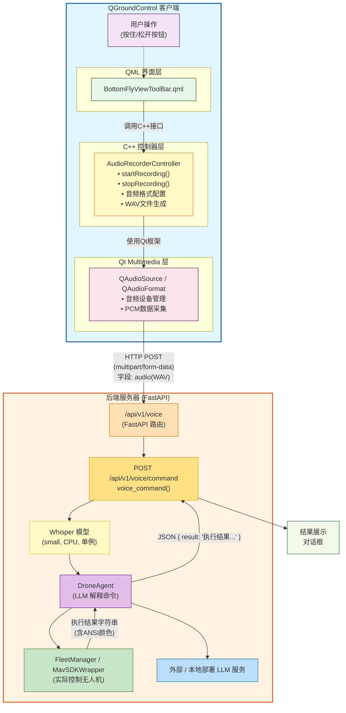
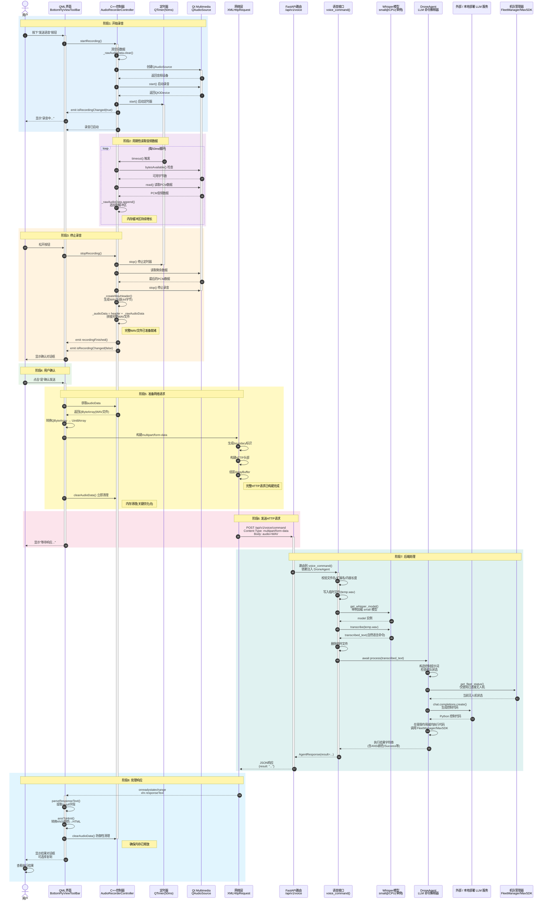
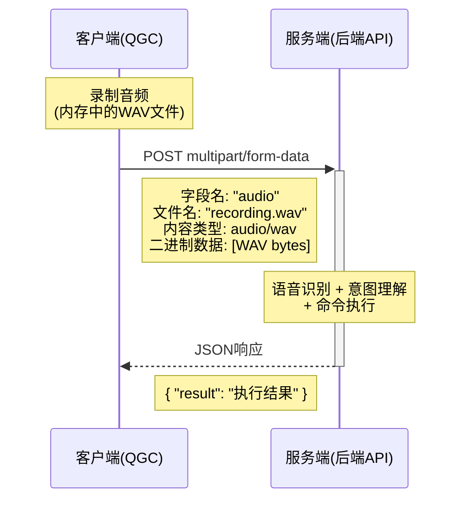

## 1. 概述

### 1.1 版本信息

**基础版本**：QGroundControl v5.0.6 Stable
**开发目标**：为QGC添加语音交互能力，实现通过自然语言控制无人机


### 1.2 二次开发说明

本实现在不修改QGC核心功能的前提下，通过以下方式扩展语音交互能力：

**新增源文件**：
- `AudioRecorderController.h/cc`：独立的音频录制控制器
- `BackendSettings.h/cc`：后端配置管理
- `Backend.SettingsGroup.json`：配置项定义
- `BottomFlyViewToolBar.qml`：添加语音按钮和交互逻辑

**修改现有文件**：
- `QGroundControlQmlGlobal.cc`：注册新的QML类型
- `CMakeLists.txt`：添加新源文件到构建系统
- `MainWindow.qml`：添加全局状态管理

**保持兼容性**：
- 所有新功能作为可选模块，不影响现有功能
- 使用QGC现有的设置管理框架
- 遵循QGC的代码风格和架构设计
- 新增组件与原有组件解耦，便于独立维护

## 2. 系统架构

### 2.1 整体架构图



### 2.2 数据流向：时序图

#### 完整交互流程




## 3. 核心组件

### 3.1 AudioRecorderController（C++音频控制器）


#### 类设计

```cpp
class AudioRecorderController : public QObject
{
    Q_OBJECT
    QML_ELEMENT
    
    // QML可访问属性
    Q_PROPERTY(bool isRecording READ isRecording NOTIFY isRecordingChanged)
    Q_PROPERTY(QByteArray audioData READ audioData NOTIFY audioDataChanged)
    Q_PROPERTY(int audioDataSize READ audioDataSize NOTIFY audioDataChanged)
    
public:
    explicit AudioRecorderController(QObject *parent = nullptr);
    ~AudioRecorderController();
    
    // 公共方法 - QML可调用
    Q_INVOKABLE void startRecording();
    Q_INVOKABLE void stopRecording();
    Q_INVOKABLE void clearAudioData();
    
signals:
    void isRecordingChanged(bool isRecording);
    void audioDataChanged();
    void recordingFinished();
    void errorOccurred(const QString &errorString);
    
private:
    QAudioSource*  _audioSource;        // 音频输入设备
    QIODevice*     _audioIODevice;      // I/O设备接口
    QTimer*        _readTimer;          // 定时读取音频数据
    QAudioFormat   _audioFormat;        // 音频格式配置
    QByteArray     _rawAudioData;       // 原始PCM数据
    QByteArray     _audioData;          // 完整WAV数据（含头部）
    bool           _isRecording;        // 录制状态
};
```

### 3.2 音频格式配置
```cpp
AudioRecorderController::AudioRecorderController(QObject *parent)
    : QObject(parent)
    , _audioSource(nullptr)
    , _audioIODevice(nullptr)
    , _readTimer(new QTimer(this))
    , _isRecording(false)
{
    // 配置音频格式: 16位PCM, 44100Hz采样率, 单声道
    _audioFormat.setSampleRate(44100);
    _audioFormat.setChannelCount(1);
    _audioFormat.setSampleFormat(QAudioFormat::SampleFormat::Int16);
    
    // 设置定时器周期性读取音频数据（每50ms）
    _readTimer->setInterval(50);
    _readTimer->setSingleShot(false);
    connect(_readTimer, &QTimer::timeout, this, 
            &AudioRecorderController::_onAudioDataReady);
}
```

### 3.3 开始录制流程
```cpp
void AudioRecorderController::startRecording()
{
    // 1. 状态检查
    if (_isRecording) {
        qCWarning(AudioRecorderControllerLog) << "Already recording";
        return;
    }
    
    // 2. 清空旧数据
    _rawAudioData.clear();
    _audioData.clear();
    
    // 3. 创建音频源
    if (_audioSource) {
        _audioSource->deleteLater();
    }
    _audioSource = new QAudioSource(_audioFormat, this);
    
    // 4. 启动音频输入
    _audioIODevice = _audioSource->start();
    if (!_audioIODevice) {
        emit errorOccurred("Failed to start audio input device");
        return;
    }
    
    // 5. 启动定时器
    _readTimer->start();
    
    // 6. 更新状态
    _isRecording = true;
    emit isRecordingChanged(_isRecording);
}
```

### 3.4 周期性数据读取
```cpp
void AudioRecorderController::_onAudioDataReady()
{
    if (!_audioIODevice || !_isRecording) {
        return;
    }
    
    // 检查可用字节数
    qint64 bytesAvailable = _audioIODevice->bytesAvailable();
    if (bytesAvailable > 0) {
        // 读取音频数据并追加到缓冲区
        QByteArray data = _audioIODevice->read(bytesAvailable);
        if (!data.isEmpty()) {
            _rawAudioData.append(data);
            qCDebug(AudioRecorderControllerLog) 
                << "Read audio data:" << data.size() 
                << "bytes, total:" << _rawAudioData.size();
        }
    }
}
```

### 3.5 停止录制并生成WAV文件
```cpp
void AudioRecorderController::stopRecording()
{
    if (!_isRecording) {
        return;
    }
    
    // 1. 停止定时器
    _readTimer->stop();
    
    // 2. 读取剩余数据
    if (_audioIODevice && _audioIODevice->bytesAvailable() > 0) {
        QByteArray remainingData = _audioIODevice->readAll();
        if (!remainingData.isEmpty()) {
            _rawAudioData.append(remainingData);
        }
    }
    
    // 3. 停止音频源
    if (_audioSource) {
        _audioSource->stop();
    }
    _audioIODevice = nullptr;
    
    // 4. 生成WAV文件头部
    if (!_rawAudioData.isEmpty()) {
        QByteArray wavHeader = _createWavHeader(_rawAudioData.size(), 
                                                 _audioFormat);
        _audioData = wavHeader + _rawAudioData;
        
        // WAV文件结构验证
        qCDebug(AudioRecorderControllerLog) 
            << "WAV total size:" << _audioData.size();
    }
    
    // 5. 更新状态并发出信号
    _isRecording = false;
    emit isRecordingChanged(_isRecording);
    emit recordingFinished();
    emit audioDataChanged();
}
```

### 3.6 WAV文件头部生成
```cpp
QByteArray AudioRecorderController::_createWavHeader(
    qint32 dataSize, 
    const QAudioFormat &format) const
{
    QByteArray header;
    QDataStream stream(&header, QIODevice::WriteOnly);
    stream.setByteOrder(QDataStream::LittleEndian);
    
    // 计算格式参数
    qint16 numChannels = format.channelCount();      // 1 (单声道)
    qint32 sampleRate = format.sampleRate();         // 44100
    qint16 bytesPerSample = format.bytesPerSample(); // 2 (16位)
    qint16 bitsPerSample = bytesPerSample * 8;       // 16
    qint32 byteRate = sampleRate * numChannels * bytesPerSample;
    qint16 blockAlign = numChannels * bytesPerSample;
    
    // RIFF头部 (12字节)
    stream.writeRawData("RIFF", 4);
    qint32 fileSize = 36 + dataSize;  // 总大小 - 8
    stream << fileSize;
    stream.writeRawData("WAVE", 4);
    
    // fmt块 (24字节)
    stream.writeRawData("fmt ", 4);
    qint32 fmtChunkSize = 16;         // PCM格式块大小
    stream << fmtChunkSize;
    qint16 audioFormat = 1;           // PCM = 1
    stream << audioFormat;
    stream << numChannels;
    stream << sampleRate;
    stream << byteRate;
    stream << blockAlign;
    stream << bitsPerSample;
    
    // data块头 (8字节)
    stream.writeRawData("data", 4);
    stream << dataSize;
    
    // 验证头部大小 (应为44字节)
    if (header.size() != 44) {
        qCWarning(AudioRecorderControllerLog) 
            << "WAV header size incorrect:" << header.size();
    }
    
    return header;
}
```

**WAV文件格式详解**：
```text
偏移  大小  字段           值
─────────────────────────────────────
0     4     ChunkID       "RIFF"
4     4     ChunkSize     文件大小-8
8     4     Format        "WAVE"

12    4     Subchunk1ID   "fmt "
16    4     Subchunk1Size 16 (PCM)
20    2     AudioFormat   1 (PCM)
22    2     NumChannels   1 (单声道)
24    4     SampleRate    44100
28    4     ByteRate      88200 (=44100*1*2)
32    2     BlockAlign    2 (=1*2)
34    2     BitsPerSample 16

36    4     Subchunk2ID   "data"
40    4     Subchunk2Size PCM数据大小
44    N     Data          实际音频数据
```

#### 音频质量与性能平衡

| 参数 | 值 | 理由 |
|------|----|----|
| 采样率 | 44100 Hz | 标准CD音质，适合所有语音识别系统 |
| 位深度 | 16 bit | 足够的动态范围，比8bit清晰，比24bit节省空间 |
| 声道数 | 1 (单声道) | 语音识别不需要立体声，减少50%数据量 |
| 读取间隔 | 50 ms | 平衡响应性和CPU占用 |

**数据量计算**：
```text
每秒数据量 = 44100 Hz × 2 bytes × 1 channel = 88,200 bytes/s ≈ 86 KB/s
10秒录音 ≈ 860 KB
30秒录音 ≈ 2.5 MB
```

#### 音频参数配置

如需修改音频参数，编辑 `AudioRecorderController` 构造函数：

```cpp
AudioRecorderController::AudioRecorderController(QObject *parent)
{
    // 可自定义的参数
    _audioFormat.setSampleRate(44100);      // 采样率：8000, 16000, 44100, 48000
    _audioFormat.setChannelCount(1);        // 声道数：1=单声道, 2=立体声
    _audioFormat.setSampleFormat(           // 采样格式
        QAudioFormat::SampleFormat::Int16   // Int16, Int32, Float
    );
    
    // 读取间隔（毫秒）
    _readTimer->setInterval(50);            // 10-100ms范围推荐
}
```

**常见配置组合**：

| 场景 | 采样率 | 位深度 | 声道 | 数据率 |
|------|--------|--------|------|--------|
| 语音识别（推荐） | 44100Hz | 16bit | 单声道 | 86KB/s |
| 低质量/节省带宽 | 16000Hz | 16bit | 单声道 | 31KB/s |
| 高质量/专业录音 | 48000Hz | 24bit | 立体声 | 281KB/s |
| 电话音质 | 8000Hz | 16bit | 单声道 | 16KB/s |

### 3.8 QML界面层

#### 主要组件结构

```qml
Item {
    id: _root
    
    // ========== 属性定义 ==========
    property bool isBackendAlive: false
    property bool isWaitingForBackendResponse: false
    property bool isRecording: audioRecorderController.isRecording
    
    // 后端API URLs
    property string backendBaseUrl: 
        QGroundControl.settingsManager.backendSettings.backendBaseUrl.value
    property string voiceApiPath: 
        QGroundControl.settingsManager.backendSettings.voiceApiPath.value
    property string voiceApiUrl: _buildCompleteUrl(voiceApiPath)
    
    // ========== 音频录制控制器 ==========
    AudioRecorderController {
        id: audioRecorderController
        
        onRecordingFinished: {
            // 录音完成，显示确认对话框
            var dialog = voiceConfirmDialogComponent.createObject(mainWindow)
            dialog.open()
        }
        
        onErrorOccurred: function(errorString) {
            // 处理录音错误
            console.error("Audio recording error:", errorString)
        }
    }
    
    // ========== 录音按钮 ==========
    QGCButton {
        id: microphoneButton
        text: isRecording ? qsTr("录音中...") : qsTr("发送语音")
        enabled: !isWaitingForBackendResponse
        
        onPressed: {
            _root.startRecording()
        }
        
        onReleased: {
            _root.stopRecording()
        }
    }
    
    // ========== 确认对话框 ==========
    Component {
        id: voiceConfirmDialogComponent
        
        QGCPopupDialog {
            title: qsTr("发送语音指令")
            buttons: Dialog.Yes | Dialog.No
            
            onAccepted: {
                var audioData = audioRecorderController.audioData
                if (audioData && audioData.length > 0) {
                    _root.sendVoiceCommandFromMemory(audioData)
                }
            }
            
            onRejected: {
                audioRecorderController.clearAudioData()
            }
        }
    }
    
    // ========== 响应显示对话框 ==========
    Component {
        id: responseDialogComponent
        
        QGCPopupDialog {
            property string responseText: ""
            property string plainText: ""
            property string coloredHtml: ""
            
            // 可滚动的文本显示区域
            ScrollView {
                TextEdit {
                    text: responseDialog.coloredHtml
                    textFormat: TextEdit.RichText
                    readOnly: true
                    selectByMouse: true
                }
            }
            
            // 复制按钮
            QGCButton {
                text: qsTr("复制")
                onClicked: {
                    clipboard.text = responseDialog.plainText
                }
            }
        }
    }
}
```

##### 启动录制
```qml
function startRecording() {
    try {
        audioRecorderController.startRecording()
        console.log("Started recording to memory")
    } catch (e) {
        console.error("Failed to start recording:", e)
    }
}
```

##### 停止录制
```qml
function stopRecording() {
    try {
        audioRecorderController.stopRecording()
        console.log("Stopped recording")
    } catch (e) {
        console.error("Failed to stop recording:", e)
    }
}
```

##### 发送语音命令
```qml
function sendVoiceCommandFromMemory(audioData) {
    if (!audioData || audioData.length === 0) {
        console.error("No audio data to send")
        audioRecorderController.clearAudioData()
        return
    }
    
    // 设置等待状态
    mainWindow.isWaitingForBackendResponse = true
    
    try {
        // ========== 数据转换 ==========
        // 将QByteArray转换为Uint8Array
        var uint8Array = new Uint8Array(audioData.length)
        for (var i = 0; i < audioData.length; i++) {
            uint8Array[i] = audioData.charCodeAt(i) & 0xFF
        }
        
        // ========== 构建multipart请求 ==========
        var boundary = "----WebKitFormBoundary" + new Date().getTime()
        var fileName = "recording_" + new Date().getTime() + ".wav"
        
        // 辅助函数：字符串转字节数组
        function stringToBytes(str) {
            var bytes = new Uint8Array(str.length)
            for (var i = 0; i < str.length; i++) {
                bytes[i] = str.charCodeAt(i) & 0xFF
            }
            return bytes
        }
        
        // 构建multipart各部分
        var boundaryStr = "--" + boundary + "\r\n"
        var dispositionStr = 'Content-Disposition: form-data; ' +
                            'name="audio"; filename="' + fileName + '"\r\n'
        var contentTypeStr = "Content-Type: audio/wav\r\n\r\n"
        var crlfStr = "\r\n"
        var closingStr = "--" + boundary + "--\r\n"
        
        var boundaryBytes = stringToBytes(boundaryStr)
        var dispositionBytes = stringToBytes(dispositionStr)
        var contentTypeBytes = stringToBytes(contentTypeStr)
        var crlfBytes = stringToBytes(crlfStr)
        var closingBytes = stringToBytes(closingStr)
        
        // ========== 组装完整请求体 ==========
        var totalSize = boundaryBytes.length + 
                       dispositionBytes.length + 
                       contentTypeBytes.length + 
                       uint8Array.length + 
                       crlfBytes.length + 
                       closingBytes.length
        
        var multipartBuffer = new ArrayBuffer(totalSize)
        var multipartView = new Uint8Array(multipartBuffer)
        var offset = 0
        
        // 按顺序复制各部分
        multipartView.set(boundaryBytes, offset)
        offset += boundaryBytes.length
        
        multipartView.set(dispositionBytes, offset)
        offset += dispositionBytes.length
        
        multipartView.set(contentTypeBytes, offset)
        offset += contentTypeBytes.length
        
        multipartView.set(uint8Array, offset)
        offset += uint8Array.length
        
        multipartView.set(crlfBytes, offset)
        offset += crlfBytes.length
        
        multipartView.set(closingBytes, offset)
        
        // ========== 发送HTTP请求 ==========
        var xhr = new XMLHttpRequest()
        xhr.open("POST", voiceApiUrl, true)
        xhr.setRequestHeader("Content-Type", 
                            "multipart/form-data; boundary=" + boundary)
        xhr.setRequestHeader("Accept", "application/json")
        
        // 立即清理音频数据
        audioRecorderController.clearAudioData()
        console.log("Sending audio, size:", totalSize)
        
        // 发送请求
        xhr.send(multipartBuffer)
        
        // ========== 处理响应 ==========
        xhr.onreadystatechange = function() {
            if (xhr.readyState === XMLHttpRequest.DONE) {
                var status = xhr.status
                var body = xhr.responseText || ""
                
                // 确保清理内存
                audioRecorderController.clearAudioData()
                
                mainWindow.isWaitingForBackendResponse = false
                
                if (status >= 200 && status < 300) {
                    // 成功响应
                    var parsedBody = parseResponseText(body)
                    var displayText = parsedBody.length ? 
                        parsedBody : qsTr("命令执行成功，但未返回内容")
                    
                    var parsed = ansiToHtml(displayText)
                    
                    var dialog = responseDialogComponent.createObject(
                        mainWindow, {
                            responseTitle: qsTr("命令执行结果"),
                            plainText: parsed.plain,
                            coloredHtml: parsed.colored
                        }
                    )
                    dialog.open()
                } else {
                    // 错误响应
                    var errorText = qsTr("命令执行失败\n状态码: %1\n响应: %2")
                        .arg(status).arg(parseResponseText(body))
                    
                    // 显示错误对话框...
                }
            }
        }
        
        xhr.onerror = function() {
            audioRecorderController.clearAudioData()
            mainWindow.isWaitingForBackendResponse = false
            // 显示网络错误...
        }
        
    } catch (e) {
        audioRecorderController.clearAudioData()
        mainWindow.isWaitingForBackendResponse = false
        console.error("Error sending voice command:", e)
    }
}
```

##### 音频质量与性能考虑

在发送语音命令时，音频数据的质量和性能参数直接影响传输效率和识别准确度。本实现采用以下参数配置：

**音频参数配置**：

| 参数 | 值 | 理由 |
|------|----|----|
| 采样率 | 44100 Hz | 标准CD音质，适合所有语音识别系统 |
| 位深度 | 16 bit | 足够的动态范围，比8bit清晰，比24bit节省空间 |
| 声道数 | 1 (单声道) | 语音识别不需要立体声，减少50%数据量 |
| 读取间隔 | 50 ms | 平衡响应性和CPU占用 |

**数据量计算**：
```text
每秒数据量 = 44100 Hz × 2 bytes × 1 channel = 88,200 bytes/s ≈ 86 KB/s
10秒录音 ≈ 860 KB
30秒录音 ≈ 2.5 MB
```

**为什么选择这些参数**：

1. **44100 Hz 采样率**：这是标准CD音质，能够完整保留人声频率范围（20 Hz - 20 kHz），确保语音识别系统能够准确识别语音内容。虽然16000 Hz也能满足基本需求，但44100 Hz提供了更好的音质冗余，适应不同环境下的录音质量变化。

2. **16 bit 位深度**：提供了65536个量化级别，足够捕捉人声的动态范围。8 bit（256级）会导致明显的量化噪声，而24 bit虽然更精确，但会增加50%的数据量，对语音识别来说收益有限。

3. **单声道**：语音识别主要关注频率内容和时间序列，不需要立体声的空间信息。使用单声道可以将数据量减半，显著降低网络传输负担和内存占用。

4. **50 ms 读取间隔**：在录音过程中，每50毫秒读取一次音频数据，既能及时响应录音状态变化，又不会过度占用CPU资源。过短的间隔（如10 ms）会增加CPU开销，过长的间隔（如100 ms）会导致内存缓冲区过大。

**常见配置组合对比**：

| 场景 | 采样率 | 位深度 | 声道 | 数据率 | 适用性 |
|------|--------|--------|------|--------|--------|
| 语音识别（推荐） | 44100Hz | 16bit | 单声道 | 86KB/s | ✅ 最佳平衡 |
| 低质量/节省带宽 | 16000Hz | 16bit | 单声道 | 31KB/s | ⚠️ 音质可能不足 |
| 高质量/专业录音 | 48000Hz | 24bit | 立体声 | 281KB/s | ❌ 过度配置 |
| 电话音质 | 8000Hz | 16bit | 单声道 | 16KB/s | ❌ 音质较差 |

**性能影响**：

- **网络传输**：10秒录音约860 KB，即使在较慢的网络环境下也能快速上传
- **内存占用**：单次录音的内存占用可控，不会导致内存溢出
- **CPU占用**：50 ms读取间隔保证了流畅的录音体验，不会造成明显的CPU负担

如需修改音频参数，可在 `AudioRecorderController` 构造函数中调整：

```cpp
AudioRecorderController::AudioRecorderController(QObject *parent)
{
    // 可自定义的参数
    _audioFormat.setSampleRate(44100);      // 采样率：8000, 16000, 44100, 48000
    _audioFormat.setChannelCount(1);        // 声道数：1=单声道, 2=立体声
    _audioFormat.setSampleFormat(           // 采样格式
        QAudioFormat::SampleFormat::Int16   // Int16, Int32, Float
    );
    
    // 读取间隔（毫秒）
    _readTimer->setInterval(50);            // 10-100ms范围推荐
}
```

##### multipart/form-data

与上面的 `sendVoiceCommandFromMemory` 函数对应，音频数据通过 `multipart/form-data` 编码发送到后端。

##### 什么是 multipart/form-data

`multipart/form-data` 是 HTTP 协议中定义的一种内容编码类型（Content-Type），用于在单个 HTTP 请求中传输**多个不同类型的数据块**。

**核心特点**：
- **多部分传输**：可在一个请求中同时发送文本字段和二进制文件
- **边界分隔**：使用 boundary（边界标识符）分隔不同的数据部分
- **独立描述**：每个部分都有自己的 Content-Disposition 和 Content-Type
- **二进制安全**：能够正确传输任意二进制数据，不会损坏文件内容

##### 为什么使用 multipart/form-data

**文件上传的标准方式**

传统的表单编码方式 `application/x-www-form-urlencoded` 存在局限：
- 只能传输文本数据
- 会对二进制数据进行 URL 编码，导致文件体积膨胀 33%
- 无法高效传输大文件

而 `multipart/form-data` 专为文件上传设计：
- 原样传输二进制数据，无额外开销
- 可同时上传多个文件
- 支持混合文本字段和文件

**在本项目中的应用场景**

QGC 需要将录制的 WAV 音频文件发送到后端服务器进行语音识别：



**选择 multipart/form-data 的原因**：
- WAV 是二进制格式，必须保持原始字节不变
- 服务端可通过标准的文件上传处理库解析
- 符合 Web 标准，兼容性好
- 便于调试（可用 curl、Postman 等工具测试）

**与其他格式的对比**

| 编码格式 | 适用场景 | 优点 | 缺点 |
|---------|---------|------|------|
| `application/x-www-form-urlencoded` | 简单文本表单 | 简单，历史悠久 | 不支持文件，二进制数据效率低 |
| `application/json` | API 数据交换 | 结构清晰，易解析 | 二进制需 Base64 编码（+33%体积）|
| **`multipart/form-data`** | **文件上传** | **二进制高效，标准化** | **格式复杂，需手动构建** |
| `application/octet-stream` | 纯二进制流 | 最简单 | 无元数据，无法传递文件名等信息 |

#### 格式结构说明

**基本组成**：
```
请求头：
  Content-Type: multipart/form-data; boundary=<边界标识符>

请求体：
  --<边界标识符>                          ← 开始边界
  Content-Disposition: form-data; ...    ← 字段描述
  Content-Type: ...                      ← 内容类型
                                         ← 空行（重要！）
  [数据内容]                              ← 实际数据
  --<边界标识符>--                        ← 结束边界（多了两个横杠）
```

**关键概念**：
1. **Boundary（边界）**：唯一标识符，不能出现在数据内容中
2. **CRLF（\\r\\n）**：每行必须以 `\r\n` 结尾（HTTP 标准）
3. **Content-Disposition**：描述字段名（name）和文件名（filename）
4. **Content-Type**：指定数据的 MIME 类型

##### 完整请求示例
```
POST /api/v1/voice/command HTTP/1.1
Host: 127.0.0.1:8000
Content-Type: multipart/form-data; boundary=----WebKitFormBoundary1234567890
Content-Length: 44132
Accept: application/json

------WebKitFormBoundary1234567890
Content-Disposition: form-data; name="audio"; filename="recording_1234567890.wav"
Content-Type: audio/wav

RIFF....WAVE....data[二进制音频数据]
------WebKitFormBoundary1234567890--
```

##### 构建步骤
```javascript
// 1. 生成唯一boundary
var boundary = "----WebKitFormBoundary" + new Date().getTime()

// 2. 构建各个部分（所有部分都是Uint8Array）
var parts = {
    boundary:     "--" + boundary + "\r\n",
    disposition:  'Content-Disposition: form-data; name="audio"; filename="file.wav"\r\n',
    contentType:  "Content-Type: audio/wav\r\n\r\n",
    audioData:    [WAV文件的二进制数据],
    crlf:         "\r\n",
    closing:      "--" + boundary + "--\r\n"
}

// 3. 计算总大小
var totalSize = parts.boundary.length + 
                parts.disposition.length + 
                parts.contentType.length + 
                parts.audioData.length + 
                parts.crlf.length + 
                parts.closing.length

// 4. 分配ArrayBuffer
var buffer = new ArrayBuffer(totalSize)
var view = new Uint8Array(buffer)

// 5. 按顺序复制
var offset = 0
view.set(parts.boundary, offset); offset += parts.boundary.length
view.set(parts.disposition, offset); offset += parts.disposition.length
view.set(parts.contentType, offset); offset += parts.contentType.length
view.set(parts.audioData, offset); offset += parts.audioData.length
view.set(parts.crlf, offset); offset += parts.crlf.length
view.set(parts.closing, offset)

// 6. 发送
xhr.send(buffer)
```


## 4. 端到端语音链路


### 4.1 后端整体角色与接口约束

- **后端框架**：基于一个现代的 Python Web 框架构建，对外提供 REST 风格 API。
- **版本管理**：所有接口统一挂载在一个版本前缀之下，例如 `/api/v1`，便于未来扩展与兼容。
- **语音相关接口**：
  - 语音转命令接口：`POST /api/v1/voice/command`
  - 语音转文字接口（测试语音）：`POST /api/v1/voice/transcribe`
- **与 QGC 对接方式**：
  - QGC 前端通过 `multipart/form-data` 上传字段名为 `audio` 的音频文件。
  - 后端返回 JSON 结构，主体字段为 `result` 或 `text` 等，用于承载执行结果或转写文字。

### 4.2 后端分层结构

- **API 接口层**：
  - 暴露 `/voice/command` 和 `/voice/transcribe` 等 HTTP 接口。
  - 负责请求解析、基础校验、依赖注入以及异常到 HTTP 错误码的转换。

- **语音处理层**：
  - 接收上传音频，完成格式和内容的基础检查（例如：文件是否为空、扩展名是否在允许列表中）。
  - 将音频内容写入临时介质或缓冲区，以便后续语音识别模型使用。
  - 调用本地语音识别模型（如 Whisper small@CPU，单例加载），得到转写文本。

- **智能体与无人机控制层**：
  - 提供一个“无人机智能体”对象，对外暴露 `process(command_text, task_type)` 等高层方法。
  - 内部持有一个“机队管理器”对象，用于实际下发飞行指令（如起飞、降落、绕圈、飞往航点等）。
  - 通过外部大模型（LLM）完成自然语言到控制代码的转换，并在受控环境中执行。

- **配置与异常处理层**：
  - 定义一组专门的异常类型（例如：音频为空、音频格式不支持、语音模型不可用、转写结果为空、智能体未初始化等），并由统一异常处理器转换为结构化 HTTP 响应。

### 4.3 语音转命令接口：逻辑流程

语音转命令接口的逻辑可以概括为以下步骤：

1. **接收上传音频**
   - 使用一个通用的文件上传参数（例如 `audio_file`），通过 `multipart/form-data` 方式接收。
   - 若文件名缺失或内容为空，抛出如 `EmptyAudioError` 之类的业务异常。

2. **文件格式与内容校验**
   - 允许扩展名集合如：`{".wav", ".mp3", ".flac", ".m4a", ".ogg", ".webm", ".mpeg", ".mp4"}`。
   - 若扩展名不在允许列表中，抛出如 `UnsupportedAudioFormatError` 异常，并在错误信息中提示支持的格式。
   - QGC 端推荐统一上传标准 WAV（PCM, 44100Hz, 16bit, 单声道），以简化链路和调试。

3. **写入临时介质并调用语音模型**
   - 将上传的二进制内容写入一个临时路径或缓冲区，供语音识别模型使用。
   - 通过类似 `get_speech_model()` 的单例函数获取语音识别模型实例：
     - 首次调用时完成模型加载，并捕获缺少依赖、加载失败等情况。
     - 后续请求复用同一个模型实例，避免重复加载导致的性能问题。
   - 调用模型的 `transcribe(temp_audio)` 方法获得 `transcribed_text`。
   - 无论成功与否，都在合适时机删除临时音频文件或释放缓冲区，避免磁盘/内存泄漏。
   - 若 `transcribed_text` 为空，抛出如 `AudioTranscribeError` 的语义化异常。

4. **调用智能体进行命令解释与执行**
   - 通过依赖注入或全局管理函数获取当前的“无人机智能体”实例（例如 `get_drone_agent()`）。
   - 若智能体尚未正确初始化（例如机队管理器不可用等），直接返回指引用户检查环境的配置提示，而不是继续执行。
   - 调用智能体的异步方法，例如：
     - `agent.process(transcribed_text, task_type="control")`
   - 在 `task_type="control"` 场景下，智能体内部的大致逻辑为：
     1. 读取当前机队状态，只允许对“已连接无人机”进行操作。
     2. 若无可用无人机，直接返回例如“未连接任何无人机”的错误文案，而不是尝试自行连接。
     3. 构造上游约束清晰的提示词，将用户自然语言命令、可用方法列表和安全限制一同输入 LLM。
     4. 从 LLM 返回中提取 Python 控制代码片段，在受限制的命名空间内执行，仅暴露受控的机队管理对象和必要的工具方法。
     5. 汇总“生成代码文本 + 实际执行结果”，拼接成一个富文本字符串，作为最终返回值。

5. **统一结果封装与返回**
   - 将智能体返回的字符串包装到统一的响应模型中，例如：
     - `{ "result": "<带或不带 ANSI 颜色的执行结果文本>" }`
   - 发生异常时，将内部异常转换为结构化 JSON 错误响应，包含至少：
     - 机器可读的错误类型（如 `"error_type": "empty_audio"`）
     - 面向用户的错误提示（如 `"message": "音频文件为空，请重新录制后再试"`）

### 4.4 语音转文字接口（测试接口）

除语音转命令外，后端还提供一个纯“语音转文字”能力，主要用于：

- 调试语音识别链路（确认录音质量与模型表现）。
- 为其他上层应用提供字幕/转写服务。

该接口的典型行为：

1. 与 `/voice/command` 相同方式接收 `multipart/form-data` 的音频文件。
2. 复用相同的语音识别模型，将音频转写为文本。
3. 返回结构化响应，例如：
   - `text`: 转写得到的文本内容。
   - `language`: 语言标识（如 `"zh"`）。
   - `duration`: 音频时长的字符串表示。
   - `processing_time`: 服务端处理耗时的字符串表示。

### 4.5 端到端时序总结（后端视角）

结合前端章节中的整体时序图，从后端视角可以将关键步骤概括为：

1. **接收请求**：收到 `POST /api/v1/voice/command` 请求，Content-Type 为 `multipart/form-data`，字段名为 `audio`。
2. **基础校验**：检查文件名、扩展名、内容长度，过滤掉明显无效请求。
3. **语音转写**：将音频内容交给本地语音识别模型，得到自然语言 `transcribed_text`。
4. **智能体处理**：调用无人机智能体的 `process()` 方法，由 LLM 生成受约束的控制代码并执行，严格遵守“只操作已连接无人机、不自行连接”的规则。
5. **结果封装**：将执行结果封装成统一 JSON 响应返回前端，可包含 ANSI 颜色信息以便前端渲染。
6. **资源清理**：确保临时音频文件和中间缓冲在成功或异常场景下均被正确清理，避免长期资源泄漏。

## 5. API 接口规范

### 5.1 语音命令接口

#### 请求规范
```text
POST /api/v1/voice/command
Content-Type: multipart/form-data; boundary=<boundary>
Accept: application/json
```

**请求体（multipart格式）**：
```text
------WebKitFormBoundary1234567890
Content-Disposition: form-data; name="audio"; filename="recording_1234567890.wav"
Content-Type: audio/wav

[WAV文件二进制数据]
------WebKitFormBoundary1234567890--
```

**WAV文件格式要求**：
- 格式：PCM
- 采样率：44100 Hz
- 位深度：16 bit
- 声道数：1 (单声道)
- 文件格式：标准WAV (RIFF header)

#### 响应规范

**成功响应（200 OK）**：
```json
{
    "result": "命令执行成功的详细信息"
}
```

**result字段**可以包含：
- 纯文本
- 带ANSI颜色代码的文本
- 多行文本（\n换行）

**ANSI颜色代码示例**：
```text
\033[32m成功\033[0m: 起飞命令已执行
\033[33m警告\033[0m: 电池电量较低
\033[31m错误\033[0m: GPS信号弱
```

## 6. 附录：文件位置参考

#### C++文件
```text
src/QmlControls/AudioRecorderController.h       - 音频控制器头文件
src/QmlControls/AudioRecorderController.cc      - 音频控制器实现
src/Settings/BackendSettings.h                  - 后端设置头文件
src/Settings/BackendSettings.cc                 - 后端设置实现
src/QmlControls/QGroundControlQmlGlobal.cc      - QML类型注册
```

#### JSON配置文件
```text
src/Settings/Backend.SettingsGroup.json         - 后端设置配置
```

#### QML文件
```text
src/QmlControls/BottomFlyViewToolBar.qml        - 底部工具栏（含语音交互）
src/UI/MainWindow.qml                           - 主窗口状态管理
```

#### 构建配置
```text
src/QmlControls/CMakeLists.txt                  - 添加AudioRecorderController
```

---

## 参考文档

- [QGroundControl 开发文档](https://docs.qgroundcontrol.com/master/en/)
- [FastAPI 官方文档](https://fastapi.tiangolo.com/)
- [OpenAI GPT 模型 API 参考](https://platform.openai.com/docs/api-reference)
- [Whisper 模型文档](https://github.com/openai/whisper)
