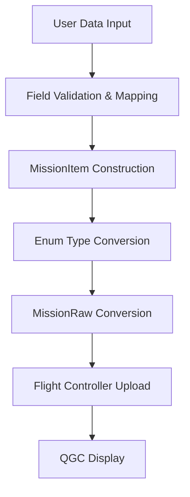

## 1. 问题背景

### 1.1 QGC 5.0.6 稳定版航点管理问题

#### 版本兼容性说明

本解决方案针对以下版本进行了测试和优化：

- **QGroundControl**: 5.0.6 Stable ([GitHub仓库](https://github.com/mavlink/qgroundcontrol))
- **MAVSDK-Python**: 3.10.2 ([GitHub仓库](https://github.com/mavlink/MAVSDK-Python))


QGroundControl (QGC) 5.0.6 稳定版在航点管理方面存在一些已知问题，这些问题主要影响无人机任务的规划和执行：

#### 主要问题表现

1. **航点数量异常增长**
   - 用户上传5个航点，QGC显示15-20个航点
   - 系统自动生成额外的航点，导致任务执行异常
   - 航点序列号不连续，影响任务逻辑

2. **航点执行异常**
   - 无人机在航点处"徘徊"不继续执行
   - 航点接受半径设置无效
   - 任务执行顺序混乱

3. **界面显示问题**
   - 航点列表显示不准确
   - 航点属性显示错误
   - 任务状态更新延迟

#### 问题影响

- **任务可靠性下降**：航点数量异常导致任务执行不可预测
- **操作效率降低**：需要手动清理多余航点
- **安全风险增加**：航点执行异常可能导致飞行安全问题

### 1.2 MAVSDK-Python MissionItem 与 QGC 兼容性问题

MAVSDK-Python 的 MissionItem 数据结构与 QGC 的航点解析机制之间存在兼容性问题，主要体现在数据结构差异和协议层面问题两个方面。在数据结构方面，MAVSDK-Python 使用 `latitude_deg`，`longitude_deg` 字段格式，而 QGC 期望 `lat`，`lng` 格式，同时 MAVSDK-Python 使用枚举类型（如 `CameraAction`，`VehicleAction`），而 QGC 期望字符串或数值，导致类型转换失败和解析错误。此外，MAVSDK-Python 的参数范围与 QGC 期望不匹配，超出范围的参数被 QGC 忽略或错误处理。

在协议层面，MAVSDK-Python 使用 `MISSION_ITEM_INT` 消息格式，但 QGC 5.0.6 对某些字段处理不当，存在消息序列号管理问题。同时，经纬度精度处理存在差异，高度参考系统不一致，坐标系转换错误导致航点位置计算偏差。

### 1.3 航点数量异常增长的根本原因分析

航点数量异常增长主要由三个核心问题导致：QGC 5.0.6 在解析航点时自动生成额外的航点，系统认为某些航点需要"连接"或"优化"，但自动生成的航点没有正确的序列号；QGC 对 `MISSION_ITEM_INT` 消息解析不完整，某些字段被错误解释为新的航点，导致消息序列号管理混乱；上传新任务前没有完全清除旧任务，新旧航点混合导致数量异常，任务状态管理不当。

在技术实现层面，QGC 5.0.6 的解析逻辑存在缺陷，当遇到某些特殊字段时会错误地创建新航点，同时 QGC 期望连续的序列号，但 MAVSDK-Python 生成的序列号可能不连续，导致 QGC 认为有"缺失"的航点。此外，经纬度精度处理不当和坐标系转换算法错误导致航点位置计算偏差。

解决方案需要采用 MissionRaw 接口直接使用 `MISSION_ITEM_INT` 消息格式，避免 QGC 的自动解析和优化，确保航点数据的一致性。同时需要在上传前完全清除旧任务，确保任务状态重置，避免新旧任务混合，并使用正确的坐标系转换和参数范围控制，避免触发 QGC 的自动优化机制。

## 2. 技术原理

### 2.1 MAVSDK-Python MissionItem 数据结构

MAVSDK-Python 的 MissionItem 是航点任务的核心数据结构，包含了无人机执行任务所需的所有信息：

#### 核心字段

```python
class MissionItem:
    # 位置信息
    latitude_deg: float          # 纬度（度，范围：-90 到 +90）
    longitude_deg: float        # 经度（度，范围：-180 到 +180）
    relative_altitude_m: float  # 相对起飞高度（米）
    
    # 飞行参数
    speed_m_s: float           # 飞行速度（米/秒）
    is_fly_through: bool       # 是否飞越航点（True=飞越，False=停留）
    acceptance_radius_m: float # 航点接受半径（米）
    yaw_deg: float            # 偏航角（度）
    
    # 云台控制
    gimbal_pitch_deg: float   # 云台俯仰角（度）
    gimbal_yaw_deg: float     # 云台偏航角（度）
    
    # 相机控制
    camera_action: CameraAction           # 相机动作
    camera_photo_interval_s: float       # 拍照间隔（秒）
    camera_photo_distance_m: float       # 拍照距离（米）
    
    # 飞行控制
    vehicle_action: VehicleAction        # 飞行器动作
    loiter_time_s: float                 # 盘旋时间（秒）
```

#### 枚举类型

```python
class CameraAction(Enum):
    NONE = "NONE"                    # 无动作
    TAKE_PHOTO = "TAKE_PHOTO"        # 拍照
    START_VIDEO = "START_VIDEO"      # 开始录像
    STOP_VIDEO = "STOP_VIDEO"        # 停止录像
    START_PHOTO_INTERVAL = "START_PHOTO_INTERVAL"  # 开始定时拍照
    STOP_PHOTO_INTERVAL = "STOP_PHOTO_INTERVAL"    # 停止定时拍照
    START_PHOTO_DISTANCE = "START_PHOTO_DISTANCE"  # 开始距离拍照
    STOP_PHOTO_DISTANCE = "STOP_PHOTO_DISTANCE"    # 停止距离拍照

class VehicleAction(Enum):
    NONE = "NONE"                    # 无动作
    TAKEOFF = "TAKEOFF"              # 起飞
    LAND = "LAND"                    # 降落
    HOLD = "HOLD"                    # 悬停
    RETURN_TO_LAUNCH = "RETURN_TO_LAUNCH"  # 返航
    TRANSITION_TO_FW = "TRANSITION_TO_FW"  # 切换到固定翼模式
    TRANSITION_TO_MC = "TRANSITION_TO_MC"  # 切换到多旋翼模式
```

### 2.2 MissionRaw 与 Mission 接口的区别

MAVSDK-Python 提供了两个不同的任务接口，它们在数据格式和用途上有重要区别：

#### Mission 接口（高层接口）

```python
# 使用 Mission 接口
from mavsdk.mission import MissionItem, MissionPlan

# 创建航点
mission_item = MissionItem(
    latitude_deg=47.641627578463165,
    longitude_deg=122.14016532897949,
    relative_altitude_m=10.0,
    speed_m_s=5.0,
    is_fly_through=True,
    # ... 其他参数
)

# 创建任务计划
mission_plan = MissionPlan([mission_item])

# 上传任务
await drone.mission.upload_mission(mission_plan)
```

**特点：**
- 使用高层数据结构
- 自动处理数据转换
- 适合简单的航点任务
- 与 QGC 兼容性较差

#### MissionRaw 接口（底层接口）

```python
# 使用 MissionRaw 接口
from mavsdk.mission_raw import MissionItem as RawMissionItem

# 创建原始航点
raw_item = RawMissionItem(
    seq=0,                                    # 序列号
    frame=6,                                  # 坐标系（MAV_FRAME_GLOBAL_RELATIVE_ALT_INT）
    command=16,                               # 命令（MAV_CMD_NAV_WAYPOINT）
    current=1,                                # 当前航点标志
    autocontinue=1,                           # 自动继续标志
    param1=0.0,                              # 参数1（盘旋时间）
    param2=5.0,                              # 参数2（接受半径）
    param3=0.0,                              # 参数3（未使用）
    param4=0.0,                              # 参数4（偏航角）
    x=476416275,                             # 纬度（度*1e7）
    y=1221401653,                            # 经度（度*1e7）
    z=10.0,                                  # 高度（米）
    mission_type=0                           # 任务类型
)

# 上传原始任务
await drone.mission_raw.upload_mission([raw_item])
```

**特点：**
- 直接使用 MAVLink 消息格式
- 完全控制数据格式
- 与 QGC 兼容性更好
- 需要手动处理数据转换

### 2.3 QGC 航点解析机制

QGroundControl 5.0.6 的航点解析机制存在一些已知问题：

#### 解析流程

1. **接收 MAVLink 消息**
   ```python
   # QGC 接收 MISSION_ITEM_INT 消息
   def parse_mission_item(message):
       seq = message.seq
       frame = message.frame
       command = message.command
       # ... 解析其他字段
   ```

2. **数据验证和转换**
   ```python
   # QGC 的数据验证逻辑（存在问题）
   if command == MAV_CMD_NAV_WAYPOINT:
       # 错误：某些条件下会创建额外航点
       if param1 > 0:  # 问题条件
           create_additional_waypoint()
   ```

3. **航点显示和存储**
   - 将解析的航点添加到任务列表
   - 更新界面显示
   - 存储到本地数据库

#### 已知问题

1. **自动航点生成**
   - QGC 5.0.6 在某些条件下会自动生成额外航点
   - 这些航点没有正确的序列号
   - 导致任务执行异常

2. **参数解析错误**
   - 某些参数被错误解释
   - 导致航点属性不正确
   - 影响任务执行逻辑

3. **坐标系转换问题**
   - 经纬度精度处理不当
   - 坐标系转换算法错误
   - 导致航点位置偏移

### 2.4 MAVLink 协议层面的兼容性

#### MISSION_ITEM_INT 消息格式

```python
# MAVLink MISSION_ITEM_INT 消息结构
class MissionItemInt:
    target_system: int      # 目标系统ID
    target_component: int   # 目标组件ID
    seq: int               # 序列号
    frame: int             # 坐标系
    command: int           # 命令类型
    current: int           # 当前航点标志
    autocontinue: int      # 自动继续标志
    param1: float          # 参数1
    param2: float          # 参数2
    param3: float          # 参数3
    param4: float          # 参数4
    x: int                 # 纬度（度*1e7）
    y: int                 # 经度（度*1e7）
    z: float               # 高度（米）
    mission_type: int      # 任务类型
```

#### 关键参数说明

1. **坐标系 (frame)**
   - `MAV_FRAME_GLOBAL_RELATIVE_ALT_INT = 6`
   - 使用相对高度的全球坐标系
   - 经纬度精度为 1e7

2. **命令类型 (command)**
   - `MAV_CMD_NAV_WAYPOINT = 16`：普通航点
   - `MAV_CMD_NAV_TAKEOFF = 22`：起飞命令
   - `MAV_CMD_NAV_LAND = 21`：降落命令

3. **参数含义**
   - `param1`：盘旋时间（秒）
   - `param2`：接受半径（米）
   - `param3`：未使用
   - `param4`：偏航角（度）

#### 兼容性要求

1. **序列号连续性**
   - 航点序列号必须连续
   - 从0开始递增
   - 不能有重复或跳跃

2. **参数范围**
   - 经纬度范围：-90 到 +90（纬度），-180 到 +180（经度）
   - 高度范围：0 到 1000 米
   - 速度范围：0.1 到 50 米/秒

3. **命令兼容性**
   - 使用标准的 MAVLink 命令
   - 避免使用非标准命令
   - 确保命令参数正确

## 3. 解决方案架构

### 3.1 双层数据转换架构

本解决方案采用双层数据转换架构，将高层 MissionItem 数据转换为底层 MissionRaw 格式，确保与 QGC 5.0.6 的完美兼容：

#### 架构组件



#### 第一层：高层 MissionItem 数据组织

```python
# 高层 MissionItem 数据构造
class MissionItemConstructor:
    def __init__(self):
        self.required_fields = [
            'latitude_deg', 'longitude_deg', 'relative_altitude_m',
            'speed_m_s', 'is_fly_through'
        ]
        self.optional_fields = [
            'gimbal_pitch_deg', 'gimbal_yaw_deg', 'camera_action',
            'loiter_time_s', 'camera_photo_interval_s', 'acceptance_radius_m',
            'yaw_deg', 'camera_photo_distance_m', 'vehicle_action'
        ]
    
    def validate_and_construct(self, waypoint_data: dict) -> MissionItem:
        """验证并构造 MissionItem 对象"""
        # 字段验证
        self._validate_required_fields(waypoint_data)
        
        # 数据类型转换
        converted_data = self._convert_data_types(waypoint_data)
        
        # 枚举类型转换
        converted_data = self._convert_enums(converted_data)
        
        # 构造 MissionItem
        return MissionItem(**converted_data)
    
    def validate_mission_data(self, mission_data: dict) -> List[MissionItem]:
        """验证并构造多个 MissionItem 对象"""
        mission_items = []
        for waypoint_data in mission_data['waypoints']:
            mission_item = self.validate_and_construct(waypoint_data)
            mission_items.append(mission_item)
        return mission_items
```

#### 第二层：底层 MissionRaw 转换器

```python
# 底层 MissionRaw 转换器
class MissionRawConverter:
    def __init__(self):
        self.MAV_FRAME_GLOBAL_RELATIVE_ALT_INT = 6
        self.MAV_CMD_NAV_WAYPOINT = 16
        self.MAV_CMD_NAV_TAKEOFF = 22
        self.MAV_CMD_NAV_LAND = 21
    
    def convert_items_to_raw(self, items: List[MissionItem]) -> List[RawMissionItem]:
        """将 MissionItem 列表转换为 RawMissionItem 列表"""
        raw_items = []
        seq_counter = 0
        
        for item in items:
            # 处理特殊命令（TAKEOFF/LAND）
            if item.vehicle_action == VehicleAction.TAKEOFF:
                raw_items.append(self._create_takeoff_item(item, seq_counter))
                seq_counter += 1
            elif item.vehicle_action == VehicleAction.LAND:
                raw_items.append(self._create_land_item(item, seq_counter))
                seq_counter += 1
                continue  # LAND 后不再添加 NAV_WAYPOINT
            
            # 创建普通航点
            raw_items.append(self._create_waypoint_item(item, seq_counter))
            seq_counter += 1
        
        return raw_items
```

### 3.2 数据流程设计

#### 完整数据流程

1. **数据输入阶段**
   ```python
   # 用户代码数据输入示例（符合航点输出协议）
   mission_data = {
       "selected_drone_id": "drone_001",
       "waypoints": [
           {
               "latitude_deg": 47.39804,
               "longitude_deg": 8.54557,
               "relative_altitude_m": 30.0,
               "speed_m_s": 5.0,
               "is_fly_through": True,
               "gimbal_pitch_deg": 0.0,
               "gimbal_yaw_deg": 0.0,
               "camera_action": "NONE",
               "loiter_time_s": 0.0,
               "camera_photo_interval_s": 0.0,
               "acceptance_radius_m": 5.0,
               "yaw_deg": 0.0,
               "camera_photo_distance_m": 0.0,
               "vehicle_action": "NONE"
           }
       ]
   }
   ```

2. **数据验证阶段**
   ```python
   # 字段验证
   def validate_mission_data(data: dict) -> dict:
       # 检查必填字段
       if 'selected_drone_id' not in data:
           raise ValueError("Missing required field: selected_drone_id")
       if 'waypoints' not in data:
           raise ValueError("Missing required field: waypoints")
       
       # 验证航点数据
       for i, waypoint in enumerate(data['waypoints']):
           required_fields = ['latitude_deg', 'longitude_deg', 'relative_altitude_m', 'speed_m_s']
           for field in required_fields:
               if field not in waypoint:
                   raise ValueError(f"Missing required field in waypoint {i}: {field}")
           
           # 数据类型验证
           waypoint['latitude_deg'] = float(waypoint['latitude_deg'])
           waypoint['longitude_deg'] = float(waypoint['longitude_deg'])
           # ... 其他字段验证
       
       return data
   ```

3. **数据转换阶段**
   ```python
   # MissionItem 构造
   mission_items = []
   for waypoint_data in mission_data['waypoints']:
       mission_item = MissionItem(
           latitude_deg=waypoint_data['latitude_deg'],
           longitude_deg=waypoint_data['longitude_deg'],
           relative_altitude_m=waypoint_data['relative_altitude_m'],
           speed_m_s=waypoint_data['speed_m_s'],
           is_fly_through=waypoint_data.get('is_fly_through', True),
           gimbal_pitch_deg=waypoint_data.get('gimbal_pitch_deg', 0.0),
           gimbal_yaw_deg=waypoint_data.get('gimbal_yaw_deg', 0.0),
           camera_action=CameraAction(waypoint_data.get('camera_action', 'NONE')),
           loiter_time_s=waypoint_data.get('loiter_time_s', 0.0),
           camera_photo_interval_s=waypoint_data.get('camera_photo_interval_s', 0.0),
           acceptance_radius_m=waypoint_data.get('acceptance_radius_m', 5.0),
           yaw_deg=waypoint_data.get('yaw_deg', 0.0),
           camera_photo_distance_m=waypoint_data.get('camera_photo_distance_m', 0.0),
           vehicle_action=VehicleAction(waypoint_data.get('vehicle_action', 'NONE'))
       )
       mission_items.append(mission_item)
   ```

4. **MissionRaw 转换阶段**
   ```python
   # 转换为 MissionRaw 格式
   raw_items = []
   for i, mission_item in enumerate(mission_items):
       raw_item = RawMissionItem(
           seq=i,
           frame=6,  # MAV_FRAME_GLOBAL_RELATIVE_ALT_INT
           command=16,  # MAV_CMD_NAV_WAYPOINT
           current=1 if i == 0 else 0,
           autocontinue=1 if mission_item.is_fly_through else 0,
           param1=mission_item.loiter_time_s,  # 盘旋时间
           param2=mission_item.acceptance_radius_m,  # 接受半径
           param3=0.0,  # 未使用
           param4=mission_item.yaw_deg,  # 偏航角
           x=int(mission_item.latitude_deg * 1e7),  # 纬度*1e7
           y=int(mission_item.longitude_deg * 1e7),  # 经度*1e7
           z=mission_item.relative_altitude_m,  # 高度
           mission_type=0
       )
       raw_items.append(raw_item)
   ```

5. **任务上传阶段**
   ```python
   # 上传到飞行控制器
   await drone.mission_raw.clear_mission()  # 清除旧任务
   await drone.mission_raw.upload_mission(raw_items)  # 上传新任务
   ```

### 3.3 兼容性保证机制

#### QGC 兼容性保证

1. **使用 MissionRaw 接口**
   - 直接使用 `MISSION_ITEM_INT` 消息格式
   - 避免 QGC 的自动解析和优化
   - 确保航点数据的一致性

2. **正确的任务清除**
   ```python
   # 上传前清除旧任务
   async def upload_mission_with_clear(self, items: List[MissionItem]):
       # 清除旧任务
       await self.drone.mission_raw.clear_mission()
       
       # 等待清除完成
       await asyncio.sleep(0.5)
       
       # 转换并上传新任务
       raw_items = self._convert_items_to_raw(items)
       await self.drone.mission_raw.upload_mission(raw_items)
   ```

3. **参数范围控制**
   ```python
   # 确保参数在 QGC 兼容范围内
   def validate_parameters(self, item: MissionItem) -> MissionItem:
       # 经纬度范围检查
       if not (-90 <= item.latitude_deg <= 90):
           raise ValueError("Latitude out of range")
       if not (-180 <= item.longitude_deg <= 180):
           raise ValueError("Longitude out of range")
       
       # 高度范围检查
       if not (0 <= item.relative_altitude_m <= 1000):
           raise ValueError("Altitude out of range")
       
       # 速度范围检查
       if not (0.1 <= item.speed_m_s <= 50):
           raise ValueError("Speed out of range")
       
       return item
   ```


## 4. 核心实现

### 4.1 MissionItem 数据构造

#### 字段映射和验证

```python
# 完整的字段映射和验证实现
class MissionItemConstructor:
    def __init__(self):
        # 必填字段定义
        self.required_fields = {
            'latitude_deg': {'type': float, 'range': (-90, 90)},
            'longitude_deg': {'type': float, 'range': (-180, 180)},
            'relative_altitude_m': {'type': float, 'range': (0, 1000)},
            'speed_m_s': {'type': float, 'range': (0.1, 50)},
            'is_fly_through': {'type': bool, 'range': None}
        }
        
        # 可选字段定义
        self.optional_fields = {
            'gimbal_pitch_deg': {'type': float, 'range': (-90, 90), 'default': 0.0},
            'gimbal_yaw_deg': {'type': float, 'range': (-180, 180), 'default': 0.0},
            'camera_action': {'type': str, 'range': None, 'default': 'NONE'},
            'loiter_time_s': {'type': float, 'range': (0, 3600), 'default': 0.0},
            'camera_photo_interval_s': {'type': float, 'range': (0, 3600), 'default': 0.0},
            'acceptance_radius_m': {'type': float, 'range': (0.1, 100), 'default': 5.0},
            'yaw_deg': {'type': float, 'range': (-180, 180), 'default': 0.0},
            'camera_photo_distance_m': {'type': float, 'range': (0, 1000), 'default': 0.0},
            'vehicle_action': {'type': str, 'range': None, 'default': 'NONE'}
        }
    
    def validate_and_construct(self, waypoint_data: dict) -> MissionItem:
        """验证并构造 MissionItem 对象"""
        try:
            # 验证必填字段
            self._validate_required_fields(waypoint_data)
            
            # 处理可选字段
            processed_data = self._process_optional_fields(waypoint_data)
            
            # 数据类型转换
            converted_data = self._convert_data_types(processed_data)
            
            # 枚举类型转换
            converted_data = self._convert_enums(converted_data)
            
            # 构造 MissionItem
            return MissionItem(**converted_data)
            
        except Exception as e:
            logger.error(f"MissionItem construction failed: {e}")
            raise ValueError(f"Invalid waypoint data: {e}")
    
    def _validate_required_fields(self, data: dict):
        """验证必填字段"""
        for field, config in self.required_fields.items():
            if field not in data:
                raise ValueError(f"Missing required field: {field}")
            
            # 类型检查
            if not isinstance(data[field], config['type']):
                try:
                    data[field] = config['type'](data[field])
                except (ValueError, TypeError):
                    raise ValueError(f"Invalid type for {field}: expected {config['type'].__name__}")
            
            # 范围检查
            if config['range'] is not None:
                min_val, max_val = config['range']
                if not (min_val <= data[field] <= max_val):
                    raise ValueError(f"{field} out of range: {data[field]} not in [{min_val}, {max_val}]")
    
    def _process_optional_fields(self, data: dict) -> dict:
        """处理可选字段"""
        processed = data.copy()
        
        for field, config in self.optional_fields.items():
            if field not in processed:
                processed[field] = config['default']
            else:
                # 类型转换
                if not isinstance(processed[field], config['type']):
                    try:
                        processed[field] = config['type'](processed[field])
                    except (ValueError, TypeError):
                        processed[field] = config['default']
                
                # 范围检查
                if config['range'] is not None:
                    min_val, max_val = config['range']
                    if not (min_val <= processed[field] <= max_val):
                        processed[field] = config['default']
        
        return processed
```

#### 枚举类型转换

```python
# 枚举类型转换实现
class EnumConverter:
    def __init__(self):
        self.camera_action_map = {
            'NONE': CameraAction.NONE,
            'TAKE_PHOTO': CameraAction.TAKE_PHOTO,
            'START_VIDEO': CameraAction.START_VIDEO,
            'STOP_VIDEO': CameraAction.STOP_VIDEO,
            'START_PHOTO_INTERVAL': CameraAction.START_PHOTO_INTERVAL,
            'STOP_PHOTO_INTERVAL': CameraAction.STOP_PHOTO_INTERVAL,
            'START_PHOTO_DISTANCE': CameraAction.START_PHOTO_DISTANCE,
            'STOP_PHOTO_DISTANCE': CameraAction.STOP_PHOTO_DISTANCE
        }
        
        self.vehicle_action_map = {
            'NONE': VehicleAction.NONE,
            'TAKEOFF': VehicleAction.TAKEOFF,
            'LAND': VehicleAction.LAND,
            'HOLD': VehicleAction.HOLD,
            'RETURN_TO_LAUNCH': VehicleAction.RETURN_TO_LAUNCH,
            'TRANSITION_TO_FW': VehicleAction.TRANSITION_TO_FW,
            'TRANSITION_TO_MC': VehicleAction.TRANSITION_TO_MC
        }
    
    def convert_camera_action(self, action_str: str) -> CameraAction:
        """转换相机动作枚举"""
        action_upper = str(action_str).upper()
        if action_upper in self.camera_action_map:
            return self.camera_action_map[action_upper]
        else:
            logger.warning(f"Unknown camera action: {action_str}, using NONE")
            return CameraAction.NONE
    
    def convert_vehicle_action(self, action_str: str) -> VehicleAction:
        """转换飞行器动作枚举"""
        action_upper = str(action_str).upper()
        if action_upper in self.vehicle_action_map:
            return self.vehicle_action_map[action_upper]
        else:
            logger.warning(f"Unknown vehicle action: {action_str}, using NONE")
            return VehicleAction.NONE
```

#### 数据完整性检查

```python
# 数据完整性检查实现
class DataIntegrityChecker:
    def __init__(self):
        self.coordinate_precision = 1e7  # 经纬度精度
        self.max_waypoint_distance = 1000  # 最大航点距离（米）
    
    def check_waypoint_integrity(self, waypoints: List[MissionItem]) -> bool:
        """检查航点数据完整性"""
        try:
            # 检查航点数量
            if len(waypoints) == 0:
                raise ValueError("No waypoints provided")
            
            if len(waypoints) > 100:
                raise ValueError("Too many waypoints (max 100)")
            
            # 检查航点间距
            self._check_waypoint_distances(waypoints)
            
            # 检查高度一致性
            self._check_altitude_consistency(waypoints)
            
            # 检查速度合理性
            self._check_speed_consistency(waypoints)
            
            return True
            
        except Exception as e:
            logger.error(f"Waypoint integrity check failed: {e}")
            return False
    
    def _check_waypoint_distances(self, waypoints: List[MissionItem]):
        """检查航点间距"""
        for i in range(1, len(waypoints)):
            prev_wp = waypoints[i-1]
            curr_wp = waypoints[i]
            
            distance = self._calculate_distance(
                prev_wp.latitude_deg, prev_wp.longitude_deg,
                curr_wp.latitude_deg, curr_wp.longitude_deg
            )
            
            if distance > self.max_waypoint_distance:
                raise ValueError(f"Waypoint {i} too far from previous waypoint: {distance}m")
    
    def _check_altitude_consistency(self, waypoints: List[MissionItem]):
        """检查高度一致性"""
        altitudes = [wp.relative_altitude_m for wp in waypoints]
        min_alt = min(altitudes)
        max_alt = max(altitudes)
        
        if max_alt - min_alt > 500:  # 高度差超过500米
            logger.warning("Large altitude variation in waypoints")
    
    def _check_speed_consistency(self, waypoints: List[MissionItem]):
        """检查速度一致性"""
        speeds = [wp.speed_m_s for wp in waypoints]
        for speed in speeds:
            if speed < 0.1 or speed > 50:
                raise ValueError(f"Invalid speed: {speed}m/s")
```

### 4.2 _convert_items_to_raw() 转换器

#### MAVLink 命令映射

```python
# 完整的 MissionRaw 转换器实现
class MissionRawConverter:
    def __init__(self):
        # MAVLink 常量定义
        self.MAV_FRAME_GLOBAL_RELATIVE_ALT_INT = 6
        self.MAV_CMD_NAV_WAYPOINT = 16
        self.MAV_CMD_NAV_TAKEOFF = 22
        self.MAV_CMD_NAV_LAND = 21
        self.MAV_CMD_NAV_RETURN_TO_LAUNCH = 20
        
        # 坐标精度
        self.COORDINATE_PRECISION = 1e7
    
    def convert_items_to_raw(self, items: List[MissionItem]) -> List[RawMissionItem]:
        """将 MissionItem 列表转换为 RawMissionItem 列表"""
        raw_items = []
        seq_counter = 0
        
        for i, item in enumerate(items):
            try:
                # 处理特殊命令
                if item.vehicle_action == VehicleAction.TAKEOFF:
                    raw_items.append(self._create_takeoff_item(item, seq_counter))
                    seq_counter += 1
                elif item.vehicle_action == VehicleAction.LAND:
                    raw_items.append(self._create_land_item(item, seq_counter))
                    seq_counter += 1
                    continue  # LAND 后不再添加 NAV_WAYPOINT
                elif item.vehicle_action == VehicleAction.RETURN_TO_LAUNCH:
                    raw_items.append(self._create_rtl_item(item, seq_counter))
                    seq_counter += 1
                    continue
                
                # 创建普通航点
                raw_items.append(self._create_waypoint_item(item, seq_counter))
                seq_counter += 1
                
            except Exception as e:
                logger.error(f"Failed to convert waypoint {i}: {e}")
                raise ValueError(f"Waypoint conversion failed: {e}")
        
        return raw_items
    
    def _create_waypoint_item(self, item: MissionItem, seq: int) -> RawMissionItem:
        """创建普通航点"""
        return RawMissionItem(
            seq=seq,
            frame=self.MAV_FRAME_GLOBAL_RELATIVE_ALT_INT,
            command=self.MAV_CMD_NAV_WAYPOINT,
            current=1 if seq == 0 else 0,
            autocontinue=1 if item.is_fly_through else 0,
            param1=item.loiter_time_s,
            param2=item.acceptance_radius_m,
            param3=0.0,  # 未使用
            param4=item.yaw_deg,
            x=int(item.latitude_deg * self.COORDINATE_PRECISION),
            y=int(item.longitude_deg * self.COORDINATE_PRECISION),
            z=item.relative_altitude_m,
            mission_type=0
        )
    
    def _create_takeoff_item(self, item: MissionItem, seq: int) -> RawMissionItem:
        """创建起飞命令"""
        return RawMissionItem(
            seq=seq,
            frame=self.MAV_FRAME_GLOBAL_RELATIVE_ALT_INT,
            command=self.MAV_CMD_NAV_TAKEOFF,
            current=1 if seq == 0 else 0,
            autocontinue=1,
            param1=0.0,  # 最小俯仰角（多旋翼不使用）
            param2=0.0,
            param3=0.0,
            param4=item.yaw_deg,
            x=int(item.latitude_deg * self.COORDINATE_PRECISION),
            y=int(item.longitude_deg * self.COORDINATE_PRECISION),
            z=item.relative_altitude_m,  # 起飞高度
            mission_type=0
        )
    
    def _create_land_item(self, item: MissionItem, seq: int) -> RawMissionItem:
        """创建降落命令"""
        return RawMissionItem(
            seq=seq,
            frame=self.MAV_FRAME_GLOBAL_RELATIVE_ALT_INT,
            command=self.MAV_CMD_NAV_LAND,
            current=1 if seq == 0 else 0,
            autocontinue=0,  # 降落不自动继续
            param1=0.0,
            param2=0.0,
            param3=0.0,
            param4=item.yaw_deg,
            x=int(item.latitude_deg * self.COORDINATE_PRECISION),
            y=int(item.longitude_deg * self.COORDINATE_PRECISION),
            z=0.0,  # 降落时高度为0
            mission_type=0
        )
    
    def _create_rtl_item(self, item: MissionItem, seq: int) -> RawMissionItem:
        """创建返航命令"""
        return RawMissionItem(
            seq=seq,
            frame=self.MAV_FRAME_GLOBAL_RELATIVE_ALT_INT,
            command=self.MAV_CMD_NAV_RETURN_TO_LAUNCH,
            current=1 if seq == 0 else 0,
            autocontinue=0,
            param1=0.0,
            param2=0.0,
            param3=0.0,
            param4=0.0,
            x=0,  # 返航不需要坐标
            y=0,
            z=0,
            mission_type=0
        )
```

#### 坐标系转换

```python
# 坐标系转换实现
class CoordinateConverter:
    def __init__(self):
        self.precision = 1e7  # 经纬度精度
    
    def deg_to_int7(self, degrees: float) -> int:
        """将度数转换为 int32 格式（度*1e7）"""
        return int(round(degrees * self.precision))
    
    def int7_to_deg(self, int_value: int) -> float:
        """将 int32 格式转换为度数"""
        return int_value / self.precision
    
    def validate_coordinates(self, lat: float, lon: float) -> bool:
        """验证坐标有效性"""
        return (-90 <= lat <= 90) and (-180 <= lon <= 180)
    
    def calculate_distance(self, lat1: float, lon1: float, lat2: float, lon2: float) -> float:
        """计算两点间距离（米）"""
        from math import radians, cos, sin, asin, sqrt
        
        # 转换为弧度
        lat1, lon1, lat2, lon2 = map(radians, [lat1, lon1, lat2, lon2])
        
        # 使用 Haversine 公式
        dlat = lat2 - lat1
        dlon = lon2 - lon1
        a = sin(dlat/2)**2 + cos(lat1) * cos(lat2) * sin(dlon/2)**2
        c = 2 * asin(sqrt(a))
        
        # 地球半径（米）
        r = 6371000
        return c * r
```

### 4.3 upload_mission() 上传流程

#### 任务清除机制

```python
# 完整的任务上传实现
class MissionUploader:
    def __init__(self, drone):
        self.drone = drone
        self.converter = MissionRawConverter()
        self.clear_timeout = 5.0  # 清除超时时间
    
    async def upload_mission(self, items: List[MissionItem]) -> str:
        """上传任务到飞行控制器"""
        try:
            # 检查连接状态
            if not await self.drone.is_connected():
                raise ValueError("Drone not connected")
            
            # 清除旧任务
            await self._clear_existing_mission()
            
            # 转换航点
            raw_items = self.converter.convert_items_to_raw(items)
            
            # 上传新任务
            await self.drone.mission_raw.upload_mission(raw_items)
            
            logger.info(f"Mission uploaded successfully: {len(raw_items)} waypoints")
            return "Mission uploaded successfully"
            
        except Exception as e:
            logger.error(f"Mission upload failed: {e}")
            raise ValueError(f"Mission upload failed: {e}")
    
    async def _clear_existing_mission(self):
        """清除现有任务"""
        try:
            # 清除任务
            await self.drone.mission_raw.clear_mission()
            
            # 等待清除完成
            await asyncio.sleep(0.5)
            
            # 验证清除结果
            mission_items = await self.drone.mission_raw.download_mission()
            if len(mission_items) > 0:
                logger.warning("Mission clear may not be complete")
                # 再次尝试清除
                await self.drone.mission_raw.clear_mission()
                await asyncio.sleep(0.5)
            
            logger.info("Existing mission cleared")
            
        except Exception as e:
            logger.error(f"Failed to clear existing mission: {e}")
            raise ValueError(f"Mission clear failed: {e}")
```


## 参考文档

- [MAVLink 消息格式](https://mavlink.io/en/messages/)
- [QGC 航点管理](https://docs.qgroundcontrol.com/master/en/PlanView/PlanView.html)
- [MAVSDK-Python Mission API](https://mavsdk-python.readthedocs.io/en/stable/plugins_sdk.html#mission)
- [MAVLink Mission 协议](https://mavlink.io/en/services/mission.html)